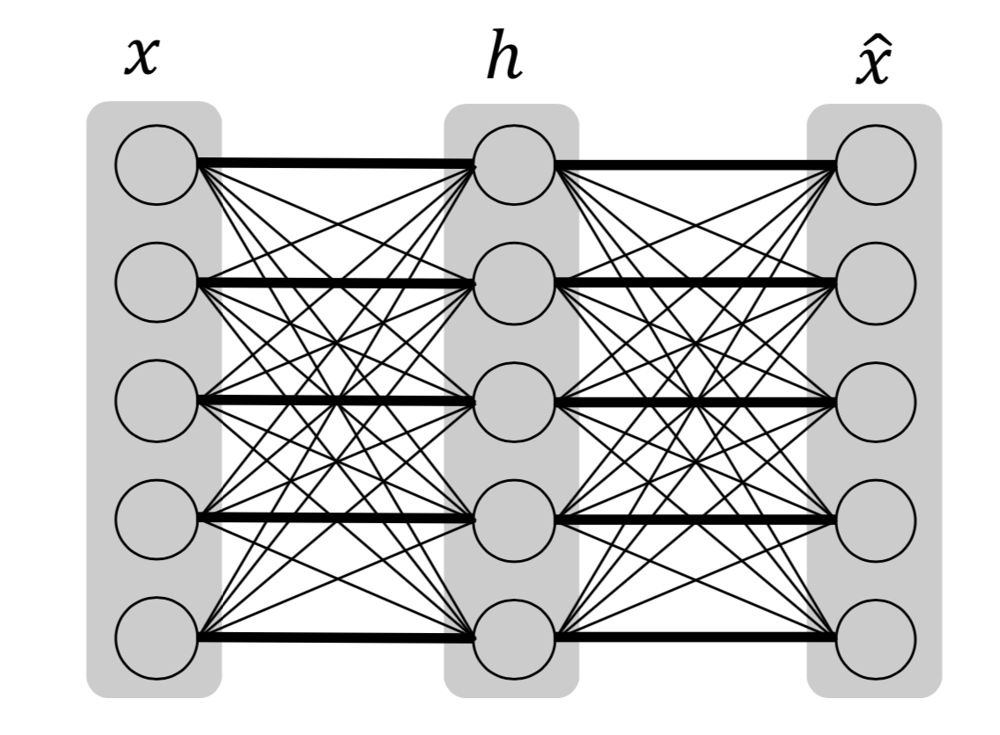
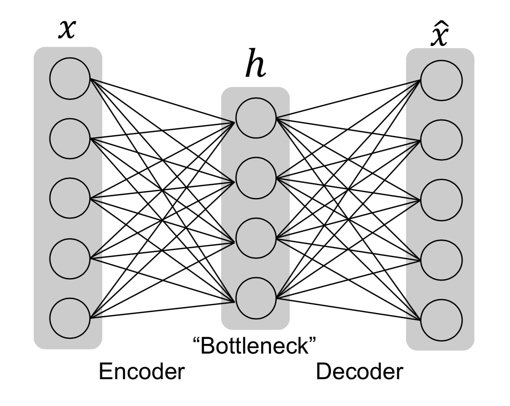

[メインページ](../../index.markdown)

[章目次](./chap3.md)
## 3.5. オートエンコーダー

<figure>

<figcaption>図3.15 オートエンコーダーは，入力から出力までを記憶する．太字の接続は入力から出力まで記憶することを示し，他の接続はオートエンコーダーでは使用しない（重み0）ことを示す.</figcaption>

</figure>

オートエンコーダーは，入力を再現して出力しようとするニューラルネットワークと見なすことができる.
具体的には，オートエンコーダーは入力情報をエンコードした中間隠れ表現 $\mathbf{h}$ を持つ.
オートエンコーダーは次の2つの要素から構成される：

1.  入力
     $\mathbf{x}$ を符号化して符号化表現 $\mathbf{h}$ を生成する，エンコーダー部分
     $\mathbf{h} = f (x)$ 

2.  符号化表現  $\mathbf{h}$  から  $\mathbf{x}$ 
    を復元する，デコーダー部分 $\hat{\mathbf{x}} = g (h)$ 

もしオートエンコーダーが入力を完全に再現することができるなら,それは使い物にならない.
むしろ，オートエンコーダーはいくつかの制限を入れた上で，入力を近似的に再現するものである.
より具体的には，オートエンコーダーは入力の必要な情報を符号化表現
 $\mathbf{h}$  に圧縮して，満足のいく出力を再現する.
オートエンコーダーの一般的な構成を図3.16に示す.
入力 $\mathbf{x}$ は「ボトルネック」を通過し，ここでは符号化表現 $\mathbf{h}$ に保存できる情報が制御される.
そして，デコーダー部分 $\mathbf{h}$ を利用して入力 $\mathbf{x}$ を再構成した $\hat{\mathbf{x}}$ を出力する.
オートエンコーダーのネットワークは次の再構成誤差を最小化することで学習させることができる：

 $$ \ell(\mathbf{x}，\hat{\mathbf{x}})=\ell(\mathbf{x}，g(f(\mathbf{x})))
    
\tag{3.8} $$ 

ここで， $\ell(\mathbf{x}，\hat{\mathbf{x}})$ は $\mathbf{x}$ と $\hat{\mathbf{x}}$ の違いを表す.

<figure>

<figcaption>図3.16 オートエンコーダーの一般的な構成</figcaption>

</figure>

例えば，平均二乗誤差を $l$ とすることができる.
オートエンコーダーでは，「ボトルネック」の設計が重要である.
図3.15に示すように，「ボトルネック」がないと，オートエンコーダーは単に入力を記憶してデコーダーにそのまま渡して入力を再現することを学習してしまい，オートエンコーダーが使い物にならなくなる可能性がある.
「ボトルネック」を設計する（すなわち，オートエンコーダーに制約を加える）方法はさまざまある.
自然な方法は，符号化表現 $\mathbf{h}$ の次元数を制限することであり,
これは不完全オートエンコーダーの考え方につながる.
また，正則化項を追加して入力と出力間の記憶を抑止することもでき，これは正則化オートエンコーダーの考え方につながる.

### 不完全オートエンコーダー

符号化表現 $\mathbf{h}$ の次元数が入力 $\mathbf{x}$ より小さくなるように制限することは，「ボトルネック」を設計する上で，簡単で自然な方法である.
入力次元より小さい符号化部分の次元を持つオートエンコーダーは,
「不完全」オートエンコーダーと呼ばれる.
不完全オートエンコーダーの例を図3.16に示した．
エンコーダーとデコーダーはともに1層のネットワークしか持たず，隠れ層は入力層より少ないユニットしか持っていない.
このモデルは再構成誤差を最小にすることで，入力の最も重要な特徴を隠れ符号化表現に保存することができる.

### 正則化オートエンコーダー

また，エンコーダーとデコーダーの層を重ねることで，オートエンコーダーをより深くすることができる.
深いオートエンコーダーの場合，その表現力の大きさに注意する必要がある.
オートエンコーダーは，エンコーダーとデコーダーの表現力が大きすぎると，意味があることを何も学べなくなってしまう可能性がある.
オートエンコーダーが単に「恒等関数」を学習してしまうことを防ぐため，オートエンコーダーの損失関数に正則化項を以下のように入れることができる：

 $$ \ell(\mathbf{x}，g(f(\mathbf{x})))+\eta \cdot \Omega(\mathbf{h})
    
\tag{3.9} $$ 

ここで， $\Omega(\mathbf{h})$ は正則化項で， $\eta$ は正則化項の大きさを制御するハイパーパラメータである.

(Olshausen and
Field，1997)の研究では，符号化表現 $\mathbf{h}$ の $L_1$ ノルムが正則化項として次のように導入されていた：

 $$ \Omega(\mathbf{h})=\\|\mathbf{h}\\|_1
    
\tag{3.10} $$ 

 $L_1$ ノルム正則化項によって $\mathbf{h}$ は疎になる（スパース）よう誘導される.
こうしたオートエンコーダーは「スパースオートエンコーダー」とも呼ばれる.

符号化表現をスパースにする別の方法は, $\mathbf{h}$ のニューロンがほとんどの時間で不活性であるように制約することである.
ここでいう「不活性」とは， $\mathbf{h}$ のニューロンの値が低いレベルであることを意味する.
ここまでは $\mathbf{h}$ を使って隠れ符号化状態を表現しているが，これではどのような入力がこのコードにつながるのかが明示的にわからない.
そこで，関係を明示的に表現するため，与えられた入力 $\mathbf{x}$ に対して，オートエンコーダーで学習したその符号化表現を $\mathbf{h}(x)$ とする.
サンプル集合 $\left\\{\mathbf{X}_{(i)}\right\\}_{i=1}^{m}$ の符号化表現の平均は次のように書くことができる：

 $$ \overline{\mathbf{h}}=\frac{1}{m} \sum_{i=1}^{m} \mathbf{h}\left(\mathbf{x}_{(i)}\right)
    
\tag{3.11} $$ 

次に，隠れ符号化表現の各要素が小さな値 $\rho$ に近づくようにしたい.
例えば， $\rho$ を0.05とする. (Ng et
al.，n.d.)の研究では，隠れ表現の各要素を̄平均が $\overline{\mathbf{h}}$ であるようなベルヌーイ確率変数として扱っている.
KLダイバージェンスを用いることによて，この確率変数を平均が $\rho$ のベルヌーイ確率変数に近づくよう制約することができる：

 $$ \Omega(\mathbf{h})=\sum_j\left(\rho \log \frac{\rho}{\overline{\mathbf{h}}[j]}+(1-\rho) \log \frac{1-\rho}{1-\overline{\mathbf{h}}[j]}\right)
    
\tag{3.12} $$ 

式(3.12)の正則化項を持つオートエンコーダーも「スパースオートエンコーダー」と呼ばれる.
正則化項は，「不完全オートエンコーダー」に適用することもできるが，正則化項単体で「ボトルネック」の役割を果たすこともできる.
正則化項を用いれば，隠れ符号化表現 $\mathbf{h}$ は必ずしも入力より小さい次元である必要はなくなる.

[メインページ](../../index.markdown)

[章目次](./chap3.md)

[前の節へ](./subsection_04.md) [次の節へ](./subsection_06.md)

