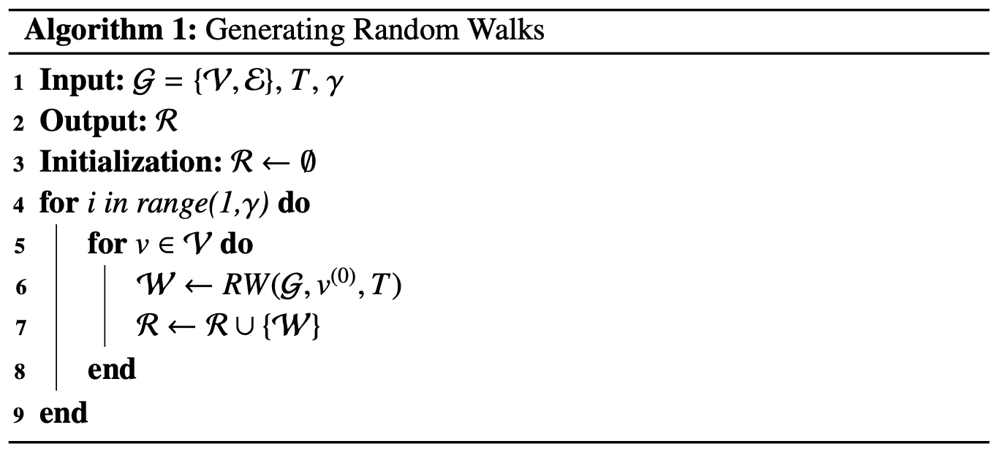
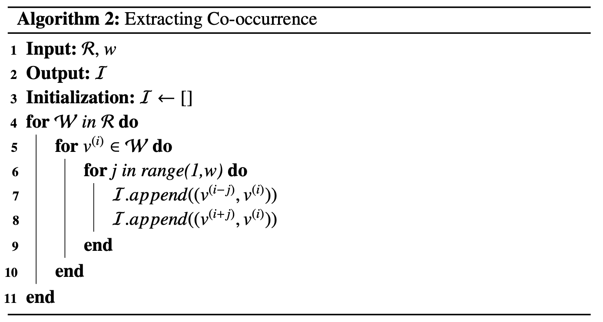

[メインページ](../../index.markdown)

[章目次](./chap4.md)
## 4.2. 単純グラフのグラフ埋め込み

本節では，単純グラフに対するグラフ埋め込みアルゴリズムを紹介する．単純グラフとは，2.2節で導入したような，静的で（ノード間の接続状況が変化しない），無向な（エッジが向きを持たない），符号付きでない（正負のエッジを含まない），ホモグラフ（1種類のノードおよび1種類のエッジから成るグラフ）を指す． 「ノードの共起性」「ノードの構造的な役割」「ノードの状態」「コミュニティの構造」など，保存対象の情報に応じてアルゴリズムを以下に整理した．

### ノード共起性の保存

グラフ中のノードの"共起関係"を抽出する最も一般的な方法の1つは，"ランダムウォーク"（あとで定義する）を実行することである． これらのランダムウォークで共起する傾向があるノードは，互いに「類似している」とみなされる． そしてマッピング関数は，ランダムウォークから抽出された"類似性"を学習し，それを再構成できるように最適化していくことになる． 代表的なグラフ埋め込みアルゴリズムとして，ノードの共起性を保存するDeepWalk (Perozzi et al., 2014)がある． 以下では，DeepWalkのアルゴリズムの詳細を，マッピング関数や情報抽出，再構成，目的関数といった一般的なフレームワークに照らし合わせながら紹介していく．その次に，ノード共起性を保存する他のアルゴリズムであるnode2vec (Grover and Leskovec, 2016)やLINE (Tang et al., 2015)を紹介する．

#### マッピング関数

マッピング関数 $f(v_i)$ を定義する直接的な方法として，"ルックアップテーブル" [^1] を用いる方法がある．これは，インデックス $i$ が与えられたとき，ノード $v_i$ の埋め込み $\symbf{u}\_i$ を取り出す(参照する)ことを意味する．具体的に，マッピング関数は以下のように実現される．

 $$ 
\tag{4.1}
    f(v_i) = \symbf{u}_i = \symbf{e}^{T}_i\symbf{W}. $$ 

ここで， $\symbf{e}_i\in \left\\{0,1\right\\}^N\,(N=\|\symbfscr{V}\|)$ は，ノード $v_i$ のワンホットエンコーディングを表している（つまり $\symbf{e}_i$ は，1つの要素だけ $\symbf{e}_i[i]=1$ であり，他の要素は全て $0$ となる）．また $\symbf{W}\in \mathbb{R}^{N\times d}$ は， $d$ を埋め込み次元とした，学習対象である埋め込みパラメータで，行列 $\symbf{W}$ の $i$ 番目の行はノード $v_i$ の表現（または埋め込み）を表す．ゆえに，マッピング関数のパラメータ数は $N\times d$ 個となる．

#### ランダムウォークに基づく共起性の抽出

グラフ $\symbfscr{G}$ の始点ノード $v^{(0)}$ が与えられたとき，そこから隣接するノードを無作為(ランダム)に選び，そのノードに向かって移動（ウォーク）する． この移動プロセスを，始点ノードから始めて $T$ 個のノードを訪れるまで繰り返す．こうしてランダムに訪れてきたノードを集めた列(sequence)のことを，グラフ $\symbfscr{G}$ における長さ $T$ のランダムウォークという．ランダムウォークを形式的に定義すると以下のようになる． 

 
<strong>定義 4.1 ランダムウォーク，Random Walk</strong>
  $\symbfscr{G} = \left\{\symbfscr{V},\symbfscr{E}\right\}$ を連結グラフとし，始点ノードを $v^{0}\in \symbfscr{V}$ とする．いま $t$ ステップ目でノード $v^{(t)}$ にいると仮定した場合，ランダムウォークは，次の移動先のノードを以下の確率で選択することで進められる．

 $$ p(v^{(t+1)}\| v^{(t)}) = 
    \begin{cases}
        \dfrac{1}{d(v^{(t)})}, & v^{(t+1)} \in \symbfscr{N}(v^{(t)})\\
        0, & \text{otherwise}
    \end{cases}\nonumber $$ 

ここで， $d(v^{(t)})$ はノード $v^{(t)}$ の次数で， $\symbfscr{N}(v^{(t)})$ は $v^{(t)}$ に隣接するノードの集合を表す．つまり，移動先のノードは現在いるノードの近傍から一様分布に従ってランダムに選択される． 

上記の処理を，次のような"ランダムウォーク生成器"を用いてまとめる．

 $$ \nonumber
    \symbfscr{W} = \textrm{RW}(\symbfscr{G},v^{(0)},T) $$ 

 $\symbfscr{W}=(v^{(0)},\dots,v^{(T-1)})$ は生成されたランダムウォークを表しており， $v^{(0)}$ は始点ノード， $T$ はランダムウォークの長さである．

ランダムウォークは，コンテンツ推薦(Fouss et al., 2007)やコミュニティ検出(Andersen et al., 2006)など，様々なタスクにおいて類似性を測定する目的で採用されている． DeepWalkでは，与えられたグラフから複数の短いランダムウォークを生成し，それらを1つの集合にまとめてノードの共起性を抽出している．以下では，ランダムウォークの集合を生成し，そこから共起性を抽出するプロセスの詳細を説明していく．

グラフ全体の情報を捉えるランダムウォークを生成するために，各ノードを始点として，ランダムウォークを $\gamma$ 個ずつ生成する．これにより，合計 $N\times\gamma$ 個のランダムウォークを得る．この処理をAlgorithm 1に示した．アルゴリズムの入力には，グラフ $\symbfscr{G}$ ，ランダムウォークの長さ $T$ ，そして各始点ノードで何回ランダムウォークを生成するかを表す $\gamma$ が含まれる．Algorithm 1の4行目から9行目では， $\symbfscr{V}$ の各ノードについて $\gamma$ 個ずつランダムウォークを生成し，それらを $\mathscr{R}$ に順次追加していく．最終的に生成された $N\times\gamma$ 個のランダムウォークを含む $\mathscr{R}$ がこのアルゴリズムの出力となる．

こうして生成したランダムウォークは，ノード集合 $\symbfscr{V}$ を語彙（単語の集まり）とする"人工言語"の文章として扱うことができる．言語モデルにおけるskip-gramアルゴリズム(Mikolov et al., 2013)は，これらの文章における単語間の共起関係を捉えることで，文章の情報を保持しようとするものである．このアルゴリズムでは，文章中の与えられた"中心単語"に対して，その中心単語から一定の距離 $w$ 以内の単語を"文脈単語"として扱う．そして中心単語は，その文脈単語と「共起している」とみなすことになる． skip-gramアルゴリズムは，このような共起情報を保持することを目的としているため，この概念をランダムウォークに適用することで，ノード間の共起関係を抽出できるようになる(Perozzi et al., 2014)．具体的には， $2$ つのノードの共起関係を組 $(v_{\text{con}},v_{\text{cen}})$ とし， $v_{\text{cen}}$ は"中心ノード"， $v_{\text{con}}$ はその"文脈ノード"の $1$ つを表している．ランダムウォークからノード間の共起関係を抽出する処理をAlgorithm 2に示した． このアルゴリズムでは，各ランダムウォーク $\symscr{W}\in\symscr{R}$ に対して，そこに含まれる各ノード $v^{(i)}$ ごとに(5行目)， $j=1,\dots,w$ の範囲にわたって $(v^{(i-j)},v^{(i)})$ と $(v^{(i+j)},v^{(i)})$ を共起リスト $\symscr{I}$ に追加している（6行目〜9行目）． なお， $i-j$ や $i+j$ がランダムウォークの範囲外である場合は，(7行目と8行目の処理を)単にスキップすることで対処する．このアルゴリズムでは，中心ノードとその文脈ノードを，それらの間の距離に関係なくすべて同等に扱っているが， Cao et al.(2015) では，中心ノードまでの距離に応じて文脈ノードの扱いを変えている．

#### 共起性の再構成および目的関数

次に，埋め込みドメインにおいて，マッピング関数とノードの共起情報から共起情報を再構成する流れを説明する． ここでは，共起情報を再構成するために， $\symscr{I}$ 内のノードの組が観測される確率を推定することを目的とする．

任意の組 $(v_{\text{con}},v_{\text{cen}})\in\symscr{I}$ に対して，ノードには中心ノード $v_{\text{cen}}$ と文脈ノード $v_{\text{con}}$ という2つの役割が存在している．各ノードは，他のノードの中心ノードや文脈ノードとして，両方の役割を果たすことができる．そのため，2つのマッピング関数を用いて，各ノードの2つの役割に対応したノード表現を生成していく．形式的には，これらのマッピング関数は次のように記述することができる．

 

$$
\begin{aligned}
    f_{\text{cen}}(v_i) = \symbf{u}_i = e^{\top}_i\symbf{W}_{\text{cen}}\nonumber\\
    f_{\text{con}}(v_i) = \symbf{u}_i = e^{\top}_i\symbf{W}_{\text{con}}\nonumber
\end{aligned}
$$
 

組 $(v_{\text{con}},v_{\text{cen}})$ という共起関係は，中心ノード $v_{\text{cen}}$ の文脈内で $v_{\text{con}}$ が観測されるという形で説明できる．  $v_{\text{cen}}$ の文脈で $v_{\text{con}}$ が観測される確率は， $2$ つのマッピング関数である $f_{\text{cen}}$ と $f_{\text{con}}$ を用いたソフトマックス関数によって，次のようにモデル化できる．

 $$ 
\tag{4.2}
    p(v_{\text{con}}\|v_{\text{cen}}) = \dfrac{\exp (f_{\text{con}}(v_{\text{con}})^{\top}f_{\text{cen}}(v_{\text{cen}}))}{\displaystyle\sum_{v\in\symbfscr{V}}\exp (f_{\text{con}}(v)^{\top}f_{\text{cen}}(v_{\text{cen}}))}. $$ 

この式は，組 $(v_{\text{con}},v_{\text{cen}})$ に対する埋め込みドメインから再構成された情報とみなすことができる． 任意の与えられた組 $(v_{\text{con}},v_{\text{cen}})$ に対して，再構成関数 $\textrm{Rec}$ は式(4.2)の確率を返し，それは次のように整理できる．

 $$ \nonumber
    \textrm{Rec}((v_{\text{con}},v_{\text{cen}})) = p(v_{\text{con}}\|v_{\text{cen}}) $$ 

埋め込みドメインから元のグラフ情報 $\symscr{I}$ を正確に推測できれば，抽出された情報 $\symscr{I}$ はうまく再構成されたとみなせる． その目的を達成するために， $\textrm{Rec}$ 関数は， $\symscr{I}$ に含まれるノード組に対して高い確率を返し，ランダムに生成されたノード組に対しては低い確率を返す必要がある． そして共起リスト $\symscr{I}$ 内のこれらのノード組は，skip-gramアルゴリズムと同様に，互いに独立していると仮定する(Mikolov et al., 2013)．以上から， $\symscr{I}$ を再構成する確率は次のようにモデル化できる．

 $$ 
\tag{4.3}
    \symscr{I}^{\prime} = \textrm{Rec}(\symscr{I}) = \prod_{(v_{\text{con}}, v_{\text{cen}})\;\in\;\symscr{I}} p(v_{\text{con}}\|v_{\text{cen}}). $$ 

 $\symscr{I}$ には重複したノード組が存在する可能性があるため，式(4.3)の重複を除くため，以下のように定式化しなおす．

 $$ 
\tag{4.4}
    \prod_{(v_{\text{con}}, v_{\text{cen}})\;\in \;\textrm{set}(\symscr{I})}p(v_{\text{con}}\|v_{\text{cen}})^{\# (v_{\text{con}}, v_{\text{cen}})}. $$ 

ここで， $\text{set}(\symscr{I})$ は $\symscr{I}$ に含まれる重複のない一意なノード組の集合を表しており， $\\# (v_{\text{con}}, v_{\text{cen}})$ は $\symscr{I}$ 内でのノード組 $(v_{\text{con}}, v_{\text{cen}})$ の出現頻度である． それゆえ， $\symscr{I}$ 内で頻繁に出現するノード組は，式(4.4)における全体の確率に大きく寄与することになる． より良い再構成を行うためには，マッピング関数のパラメータを学習する際，式(4.4)の最大化を目指す必要がある．したがって，（2つのマッピング関数のパラメータである）ノード埋め込み $\symbf{W}\_{\text{con}}$ と $\symbf{W}\_{\text{cen}}$ は，以下の目的関数を最小化することで学習できる．

 $$ 
\tag{4.5}
    \symscr{L}(\symbf{W}_{\text{con}}, \symbf{W}_{\text{cen}}) = - \sum_{(v_{\text{con}}, v_{\text{cen}})\;\in\;\text{set}(\symscr{I})} \#(v_{\text{con}}, v_{\text{cen}})\cdot\log p(v_{\text{con}}\|v_{\text{cen}}). $$ 

この目的関数は式(4.4)の負の対数である．

#### 学習過程の高速化

実際に式(4.2)で確率を計算することは，計算上不可能である． というのも，その分母に全ノードに対する総和があるためである． この課題を対処するために，主に $2$ つの手法が採用されている．1つは階層的ソフトマックス，もう1つはネガティブサンプリングである(Mikolov et al., 2013)．

#### 階層的ソフトマックス

階層的ソフトマックスでは，グラフ $\symbfscr{G}$ のノードを二分木の葉に割り当てる [^2] ．

<figure>

<figcaption>図4.2 階層的ソフトマックスの例．ノード $v_3$ へのパスを赤く強調した．</figcaption>

</figure>

この二分木には $8$ つの葉があるため，元のグラフ $\symbfscr{G}$ には $8$ つのノードが存在することになる． そのため確率 $p(v_{\text{con}}\|v_{\text{cen}})$ は，二分木の葉ノード $v_{\text{con}}$ へのパスを通じてモデル化できる． もし，ノード $v_{\text{con}}$ へのパスを，根ノード $p^{(0)}=b_0$ から $p^{(H)}=v_{\text{con}}$ までの二分木上のノード列 $(p^{(0)}, p^{(1)},\dots, p^{(H)})$ として与えた場合，確率 $p(v_{\text{con}}\|v_{\text{cen}})$ は以下のように計算される．

 $$ \nonumber
    p(v_{\text{con}}\|v_{\text{cen}}) = \prod^{H}_{h=1}p_{\text{path}}(p^{(h)}\|v_{\text{cen}}). $$ 

式中の $p_{\text{path}}(p^{(h)}\|v_{\text{cen}})$ は，「中心ノードの表現 $f(v_{\text{cen}})$ を入力とする二値分類器」としてモデル化することになる．具体的には，(二分木上の)各内部ノードに対して，"次に進むノードを決定する"ための二値分類器が構築される．

根ノード $b_0$ を使って，図4.2に示す一例で確率 $p(v_3\|v_8)$ （ $(v_{\text{con}},v_{\text{cen}}=(v_3,v_8))$ ）を計算している二値分類を説明しよう．根ノード $b_0$ において，左のノードに進む確率は

 $$ \nonumber
    p(\text{left}\|b_0, v_8) = \sigma(f_b(b_0)^{\top}f(v_8)), $$ 

として計算される．ここで， $f_b$ は内部ノードのマッピング関数， $f$ は葉ノード（グラフ $\symbfscr{G}$ 中のノード）のマッピング関数， $\sigma$ はシグモイド関数である． 一方 $b_0$ において，右のノードに進む確率は，

 $$ \nonumber
    p(\text{right}\|b_0, v_8) = 1 - p(\text{left}\| b_0, v_8) = \sigma(-f_b(b_0)^{\top}f(v_8)) $$ 

と計算できる．以上のことから，以下を得る．

 $$ \nonumber
    p_{\text{path}}(b_1\|v_8) = p(\text{left}\|b_0, v_8). $$ 

なお，内部ノードの埋め込みは二値分類のパラメータとみなすことができ，また，これら二値分類の入力は $(v_{\text{con}}, v_{\text{cen}})$ における中心ノードの埋め込み $f(v_{\text{cen}})$ である． 式(4.2)で表される従来のソフトマックスの代わりに階層的ソフトマックスを用いることで，計算量を $O(\|\symbfscr{V}\|)$ から $O(\log \|\symbfscr{V}\|)$ へと大幅に削減することができる． ただし，階層的ソフトマックスでは， $\symbfscr{V}$ の各ノードに対して $2$ つのマッピング関数を学習するのではなく， $\symbfscr{V}$ のノード（二分木では葉ノード）に対してはマッピング関数 $f$ ，二分木の内部ノードに対してはマッピング関数 $f_b$ を学習することになる． 

 
<strong>例 4.2 階層的ソフトマックス</strong>
 与えられたグラフ $\symbfscr{G}$ において，文脈ノード $v_3$ と中心ノード $v_8$ の共起情報を記述したノード組を $(v_3,v_8)$ とし，このグラフに対する階層的ソフトマックスの二分木を図4.2に示すものとする． $v_8$ の文脈で $v_3$ を観測する確率，すなわち $p(v_3\|v_8)$ は次のように計算される．  

$$
\begin{aligned}
        p(v_3\|v_8) &= p_{\text{path}}(b_1\|v_8)\cdot p_{\text{path}}(b_4\|v_8)\cdot p_{\text{path}}(v_3\|v_8)\nonumber\\
        &= p(\text{left}\|b_0,v_8)\cdot p(\text{right}\|b_1,v_8)\cdot p(\text{left}\|b_4,v_8).\nonumber
    
\end{aligned}
$$
  

#### ネガティブサンプリング

学習プロセスを高速化する，別の手法としてはネガティブサンプリングがある(Mikolov et al., 2013)．これはNoise contrastive estimation (NCE; Gutmann and Hyvärinen, 2012) [^3] を簡略化した手法で，これによりソフトマックスの対数確率を近似的に最大化できる．今回の場合，最終的な目標は，確率を最大化することではなく高品質のノード表現を学習することにあるから，学習されたノード表現が良好な品質を保つ限り，NCEを簡略化することは妥当である．そこで，NCEを修正したネガティブサンプリングを以下のように定義する：

 $\symscr{I}$ の各ノード組 $(v_{\text{con}}, v_{\text{cen}})$ について，中心ノード $v_{\text{cen}}$ の文脈に現れない $k$ 個のノードをサンプリングし，"負例(ネガティブサンプル)"としてノードの組を作成する．これら $k$ 個のノード組を用いて， $(v_{\text{con}}, v_{\text{cen}})$ に対するネガティブサンプリングを，以下の目的関数によって定義する．

 $$ 
\tag{4.6}
    \log\sigma\left(f_{\text{con}}(v_{\text{con}})^{\top}f_{\text{cen}}(v_{\text{cen}})\right) + \sum^{k}_{i=1}E_{v_n\sim P_n(v)}\left[\log\sigma\left(-f_{\text{con}}(v_n)^{\top} f_{\text{cen}}(v_{\text{cen}})\right)\right]. $$ 

ここで，確率分布 $P_n(v)$ は負例となるノード組をサンプリングするためのノイズ分布であり，Mikolov et al.(2013)やTang et al.(2015)において提案されているように $P_n(v)\sim d(v)^{3/4}$ と設定されることが多い [^4] ．

 

$$
\begin{aligned}
%NOTE: cdotを除いた(幅節約のため)
    \symcal{L}(\symbf{W}_{\text{con}}, \symbf{W}_{\text{cen}}) &=\sum_{(v_{\text{con}}, v_{\text{cen}})\in\;\text{set}(\symcal{I})}\#(v_{\text{con}}, v_{\text{cen}})\bigg(\log\sigma\Big(f_{\text{con}}(v_{\text{con}})^{\top}f_{\text{cen}}(v_{\text{cen}})\Big)\nonumber\\
    &\qquad\qquad + \sum^{k}_{i=1}E_{v_n\sim P_n(v)}\Big[\log\sigma\Big(-f_{\text{con}}(v_n)^{\top}f_{\text{cen}}(v_{\text{cen}})\Big)\Big]\bigg).
\end{aligned}
\tag{4.7}
$$
 

従来のソフトマックスの代わりにネガティブサンプリングを用いることで，計算量を $O(\|\symbfscr{V}\|)$ から $O(k)$ へと大幅に削減することができる．

#### 実際の学習プロセスについて

ここまで，式(4.5)の目的関数と，損失関数の計算効率を向上させる2つの戦略を紹介してきた． これによって，式(4.5)の目的関数（またはその代替となる関数）を最適化し，ノード表現の学習できるようになった． しかしながら，実際の学習プロセスは， $\symscr{I}$ の集合全体に対して目的関数を一度に評価し勾配降下に基づく更新を行うのではなく，通常はバッチ単位に行われる． 具体的に言えば，各ランダムウォーク $\symscr{W}$ を生成すると，それらに対応する共起情報 $\symscr{I}\_{\symscr{W}}$ を抽出することができる．  $\symscr{I}\_{\symscr{W}}$ を使った目的関数を定式化し，この目的関数の勾配を評価することで，関係するノード表現を更新することができる．

#### 共起性を保存するその他の手法

共起情報の保存を目的とした手法は他にも，node2vec (Grover and Leskovec, 2016)や，LINE (Large-scale Information Network Embedding; Tang et al., 2015)などがある． これらの手法はDeepWalkとは若干異なるが，それでも図4.1の一般的なフレームワークに当てはめることができる．次に，これらの手法についてDeepWalkとの違いに目を向けながら紹介していこう．

#### node2vec

node2vec (Grover and Leskovec, 2016)では， $\symscr{I}$ を生成する手法として， DeepWalkのランダムウォークに代わる「偏りのあるランダムウォーク(biased random walk)」を用いた手法が導入されており，これによりノードの近傍をより柔軟に探索できるようになる．具体的には， $2$ つのパラメータ $p$ と $q$ を持つ二次ランダムウォークを提案している．それは以下のように定義される． 

 
<strong>定義 4.3</strong>
  $\symbfscr{G} = \left\{\symbfscr{V},\symbfscr{E}\right\}$ を連結グラフとし，ノード $v^{(0)}\in \symbfscr{V}$ から始まるランダムウォークを考える．また，ランダムウォークによりノード $v^{(t-1)}$ からノード $v^{(t)}$ まで移動し，現在はノード $v^{(t)}$ にいると仮定する．次のステップでは，どのノードに進むかを決める必要がある．このとき， $v^{(t)}$ の近傍から一様に $v^{(t+1)}$ を選ぶのではなく， $v^{(t)}$ と $v^{(t-1)}$ の両方に基づいてサンプルする確率が定義される．具体的には，移動先のノードを選択する非正規化"確率"は次のように定義される．

 $$ 
\tag{4.8}
    \alpha_{pq}(v^{(t+1)}\|v^{(t-1)}, v^{(t)}) = 
    \begin{cases}
        \dfrac{1}{p} & \text{dis}(v^{(t-1)}, v^{(t+1)}) = 0\\
        \,1 & \text{dis}(v^{(t-1)}, v^{(t+1)}) =1\\
        \dfrac{1}{q} & \text{dis}(v^{(t-1)}, v^{(t+1)}) = 2
    \end{cases} $$ 

ここで， $\text{dis}(v^{(t-1)},v^{(t+1)})$ はノード $v^{(t-1)}$ と $v^{t+1}$ の間の最短パスの長さである．また，式(4.8)の非正規化確率は，移動先のノード $v^{(t+1)}$ をサンプルする確率として正規化できる． 

なお，この正規化確率に基づくランダムウォークは，移動先のノード $v^{(t+1)}$ を決定する際，前にいたノード $v^{(t-1)}$ と現在いるノード $v^{(t)}$ の両方を考慮することから， $2$ 次ランダムウォーク(second-order random walk)とよばれる． パラメータ $p$ は，ノード $v^{(t-1)}$ からノード $v^{(t)}$ に移動した直後に「ノード $v^{(t-1)}$ を再訪する確率」を制御するものである．具体的には， $p$ が小さいほどランダムウォークは再訪を促し，他方 $p$ が大きいほど訪れたノードへ再訪する確率が低くなるようにする． 一方パラメータ $q$ は，移動先のノードを"内側"と"外側"に区別する． $q>1$ の場合，ノード $v^{(t-1)}$ に近い(内側)ノードに偏り， $q<1$ の場合，ノード $v^{(t-1)}$ から遠い(外側)ノードに偏った移動となる傾向がある． 以上から，パラメータ $p$ と $q$ を制御することで，異なる焦点を持つランダムウォークを作り出せる．式(4.8)の(正規化した)確率分布に従ったランダムウォークを生成した後，node2vecの残りのステップはDeepWalkと同じである．

#### LINE

LINE (Tang et al., 2015)の"第二次近接性"に関する目的関数は，以下のように表すことができる [^5] ．

 

$$
\begin{aligned}
%NOTE: 誤植か？(第一項の符号をマイナス→プラスにした)
    \sum_{(v_{\text{con}}, v_{\text{cen}})\in\;\symbfscr{E}}\bigg(&\log\sigma\Big(f_{\text{con}}(v_{\text{con}})^{\top}f_{\text{cen}}(v_{\text{cen}})\Big)\nonumber\\
    &+ \sum^{k}_{i=1}E_{v_n\sim P_n(v)}\Big[\log\sigma\Big(-f_{\text{con}}(v_n)^{\top}f_{\text{cen}}(v_{\text{cen}})\Big)\Big]\bigg).
\end{aligned}
\tag{4.9}
$$
 

ここで， $\symbfscr{E}$ はグラフ $\symbfscr{G}$ が含むエッジの集合である．式(4.9)と式(4.7)を比較すると，LINEが再構成する情報として $\symscr{I}$ の代わりに $\symbfscr{E}$ を採用していることが大きく異なる点であることがわかる．実際， $\symbfscr{E}$ はランダムウォークの長さを $1$ に設定した $\symscr{I}$ の特殊なケースとみなすことができる．

#### 行列分解による表示

Qiu et al.(2018b)によれば，前述したネットワークの埋め込み手法は，行列因子分解の観点から解釈することができるとされている．例えば，DeepWalkについては，以下の定理が成立する． 

 
<strong>定理 4.4 Qiu et al., 2018b</strong>
 行列形式では，与えられたグラフ $\symbfscr{G}$ に対してネガティブサンプリングを行ったDeepWalkは，以下の行列因子分解に等価である．

 $$ \nonumber
    \log\left(\dfrac{\mathrm{vol}(\symbfscr{G})}{T}\left(\sum^{T}_{r=1}\symbf{P}^r\right)\symbf{D}^{-1}\right) - \log(k). $$ 

ここで， $\symbf{P}$ はグラフ $\symbfscr{G}$ の隣接行列 $\symbf{A}$ と対応する次数行列 $D$ の逆行列で構成した行列 $\symbf{P} = \symbf{D}^{-1}\symbf{A}$ であり， $T$ はランダムウォークの長さである．また， $\mathrm{vol}(\symbfscr{G})=\sum^{\|\symbfscr{V}\|}_{i=1}\sum^{\|\symbfscr{V}\|}_{j=1}\symbf{A}_{i,j}$ であり， $k$ はネガティブサンプルの個数である． 

 実際には，DeepWalkの行列因子分解による形式も，本章の冒頭で紹介した一般的なフレームワークに当てはめることができる． 具体的には，行列因子分解による情報抽出(Extractor)は以下のようになる．

 $$ \nonumber
    \log\left(\dfrac{\mathrm{vol}(\symbfscr{G})}{T}\left(\sum^{T}_{r=1}\symbf{P}^r\right)\symbf{D}^{-1}\right). $$ 

一方でマッピング関数(Mapping)は，DeepWalkで導入したものと同じ $f_{\text{cen}}(\cdot)$ と $f_{\text{con}}(\cdot)$ のを用いている． これら2つのマッピング関数のパラメータは， $\symbf{W}\_{\text{cen}}$ と $\symbf{W}\_{\text{con}}$ であり，それらはグラフ $\symbfscr{G}$ の2組のノード表現でもある．そしてこの場合の再構成(Reconstractor)は，" $\symbf{W}\_{\text{con}}\symbf{W}_{\text{cen}}^{\top}$ "という形で表現でき，これにより目的関数は以下のように表すことができる．

 $$ \nonumber
    \symscr{L}(\symbf{W}_{\text{con}}, \symbf{W}_{\text{cen}}) = \left\\\|\,\log\left(\dfrac{\text{vol}(\symbfscr{G})}{T}\left(\sum^{T}_{r=1}\symbf{P}^r\right)\symbf{D}^{-1}\right) - \log(k) - \symbf{W}_{\text{con}}\symbf{W}_{\text{cen}}^{\top}\, \right\\\|^2_F. $$ 

したがって，埋め込み $\symbf{W}\_{\text{con}}$ と $\symbf{W}\_{\text{cen}}$ は，この目的関数を最小化することで学習できる．同様に，LINEやnode2vecも行列形式で表現することが可能である(Qiu et al., 2018b)．

### 構造的役割の保存

<figure>

<figcaption>図4.3 構造的役割が類似している2つのノードの例．</figcaption>

</figure>

グラフドメインで互いに近い2つのノード(例えば，図4.3のノード $d$ と $e$ )は，多くのランダムウォークで共起する傾向がある．そのため，これまで紹介してきた共起性を保存する方法の下で，これらのノードは埋め込みドメインで類似した表現を学習する可能性が高くなる． しかし，実際の応用では，互いに似た"構造的な役割"を持つノード（例えば，図4.3のノード $u$ と $v$ ）に対して，これらのノード表現を埋め込みドメインで近づけたい場合がある．一例として，空港ネットワークにおいてハブ都市/非ハブ都市を区別したい場合，「互いに離れている可能性が高いが，構造的役割が似ている」ハブ都市同士を似た表現に投影すべきである． 以上のことから，構造的役割を保持できるグラフ埋め込み手法の開発が不可欠である．

struc2vecは，ノード表現を学習する際，"構造同一性"を保存する手法を提案している(Ribeiro et al., 2017)． この手法は，DeepWalkと同じマッピング関数を持ちつつ，元のグラフドメインから構造的役割の類似性を抽出している． 具体的には，ノード組の構造的役割の類似度を測定するための，次数に基づく手法が提案されており，これを用いて新しいグラフが構築される． そのため，この新しいグラフのエッジは構造的役割の類似度を表すことになる．次に，新しいグラフから共起関係を抽出するために，ランダムウォークに基づくアルゴリズムが利用される． struc2vecはDeepWalkと同じマッピング関数(Mapping)および再構成関数(Reconstractor)を共有しているため，ここではstruc2vecの情報抽出(Extractor)の詳細のみを説明する． 情報抽出では，「構造類似性の測定」や「新しいグラフの構築」，そして共起関係の抽出を目的とした「新しいグラフに基づく偏りのあるランダムウォーク」を扱うことになる．

#### 構造類似性の測定

直感的にノードの次数は，その構造的役割の類似性を示すことができる．つまり，次数の値が近い $2$ つのノードは，構造的に類似していると考えることができる．それに加え， $2$ つのノードの隣接ノードも似た次数を持つ場合，これら $2$ つのノードはより類似していると考えられる．この直感に基づいた"階層的構造類似性"の測定がRibeiro et al.(2017)で提案されている． この測定方法ではまず，ノード $v$ の $k$ 次近傍ノードの集合を $R_k(v)$ とする．そして $R_k(v)$ 中のノードを"次数列"として並べたものを $s(R_k(v))$ とする [^6] ．すると， $2$ つのノード $v_1$ と $v_2$ の $k$ 次近傍を考慮した構造距離 $g_k(v_1,v_2)$ は，以下のように再帰的に定義できる．

 $$ \nonumber
    g_k(v_1, v_2) = g_{k-1}(v_1,v_2) + \text{dis}(s(R_k(v_1)), s(R_k(v_2))). $$ 

ここで， $\text{dis}(s(R_k(v_1)), s(R_k(v_2)))\geq 0$ は「 $v_1$ と $v_2$ の次数列間の距離」を測定している．言い換えれば，「 $v_1$ と $v_2$ に対する $k$ 次近傍の次数の類似度」を表している．  $g_{-1}(\cdot,\cdot)$ は $0$ で初期化していることに注意．ゆえに，この距離の値が大きいほど，比較される $2$ つの入力ノードの構造的類似度は低くなることを意味する． また，一般に次数列 $s(R_k(v_1))$ と $s(R_k(v_2))$ は異なる長さであり，その要素は任意の（非負）整数である． したがって，異なる長さの数列を扱うことができる"動的時間伸縮法(dynamic time warping; DTW)"(Sailer, 1978; Salvador and Chan, 2007)という手法が，距離関数 $\text{dis}(\cdot,\cdot)$ として採用されている． 動的時間伸縮法は，2つの数列間で要素の対応関係を最適に調整し，対応する要素間の距離の合計を最小化するアルゴリズムである． $2$ つの要素 $a$ と $b$ 間の距離は以下のように測定される [^7] ．

 $$ \nonumber
    l(a,b) = \dfrac{\max (a,b)}{\min (a,b)} - 1. $$ 

この距離は2つの要素の最大値と最小値の比に依存しているため，例えば $l(1,2)$ の値は $l(100,101)$ の値に対して大きく異なるとみなせる．そのため，次数の差を測定する場合には望ましいといえる．

#### 構造類似性に基づくグラフの生成

ノード組に対する構造距離を求めれば，それらのノード間の構造類似性を符号化した"多層重み付きグラフ"が構成できる [^8] ．

 $$ \nonumber
w_k(u,v) = \exp(-g_k(u,v)). $$ 

ここで， $w_k(u,v)$ はグラフの $k$ 番目の層におけるノード $u$ と $v$ の間のエッジの重みを表している． 距離 $g_k(u,v)$ が小さいほど，ノード $u$ と $v$ の間の繋がりは強くなる． 次に，グラフ中の異なる層を有向エッジで接続する． つまり，第 $k$ 層のあらゆるノード $v$ は，第 $k-1$ 層や第 $k+1$ 層にある自身に対応するノードに接続していく．第 $k$ 層のノード $v$ を $v^{(k)}$ と表すと，層の間をつなぐエッジの重みは以下のように定義される．

 

$$
\begin{aligned}
%TODO: e → expと合わせた．(あっているか要確認)
    w(v^{(k)},v^{(k+1)}) &= \log (\Gamma_k (v) + \exp(1)),&\hspace{-10pt} (k&=0,\dots,k^{\ast} -1),\nonumber\\
    w(v^{(k)}, v^{(k-1)}) &= 1,&\hspace{-10pt} (k&=1,\dots, k^{\ast}).\nonumber
\end{aligned}
$$
 

ここで，

 $$ \nonumber
    \Gamma_k(v) = \sum_{v_j\in\symbfscr{V}}\symbb{1}(w_k(v, v_j) > \bar{w}_k), $$ 

である．また， $\bar{w}_k = \sum_{(u,v)\in\symbfscr{E}_k} w_k(u,v)/\dbinom{N}{2}$ は，第 $k$ 層の完全グラフ上における，エッジの重みの平均を表している（ $\symbfscr{E}_k$ は第 $k$ 層内のエッジ集合である）． したがって， $\Gamma_k(v)$ は，第 $k$ 層上で，ノード $v$ が他のノードとどれくらい類似しているかを測る指標となる．この設計により，現在の層内で他のノードに非常に類似しているノードは，次の層への強い接続を持つことが保証される．その結果，次の層に進んでより多くの情報を取得するようなランダムウォークが得られやすくなる．

#### 多層グラフ上での偏りのあるランダムウォーク

ここでは，"偏りのあるランダムウォーク"のアルゴリズムが提案されており，それによってランダムウォークの集合が生成されることになる．これらのランダムウォークは，再構成される共起ノード組を生成するために使用される． ランダムウォークにより，現在 $k$ 層中のノード $u$ にいると仮定しよう．次のステップでは，ランダムウォークは $q$ の確率で同じ層にとどまり， $1-q$ の確率で別の層に移動する（ $q$ はハイパーパラメータ）．

同じ層に留まることになった場合，現在のノード $u$ から他のノード $v$ に移る確率は次のように計算される．

 $$ \nonumber
    p_k(v\|u) = \dfrac{\exp (-g_k(v,u))}{Z_k(u)}. $$ 

 $Z_k(u)$ は $k$ 層におけるノード $u$ についての正規化因子であり，以下のように定義される．

 $$ \nonumber
    Z_k(u) = \sum_{(v,u)\in\,\symbfscr{E}_k}\exp (-g_k(v,u)). $$ 

一方，別の層に移動することになった場合， $k+1$ 層や $k-1$ 層へ移動する確率は以下のように計算される．

 

$$
\begin{aligned}
p_k(u^{(k)}, u^{(k+1)}) &= \dfrac{w(u^{(k)}, u^{(k+1)})}{w(u^{(k)}, u^{(k+1)}) + w(u^{(k)}, u^{(k-1)})}\nonumber\\
p_k(u^{(k)}, u^{(k-1)}) &= 1-p_k(u^{(k)}, u^{(k+1)}).\nonumber
\end{aligned}
$$
 

この偏りのあるランダムウォークを用いて，ノード間の共起関係を抽出できるランダムウォークの集合を生成できる．ただし，共起関係は異なるノード間のみ抽出され，異なる層の同一ノード間では抽出されないことに注意．言い換えれば，共起関係はランダムウォークが同じ層を移動するときのみ生成される．こうして共起関係は，DeepWalkのように，埋め込みドメインから再構成される情報としての役割を果たすことができる．

### ノード状態の保存

2.3.3節で説明したように，中心性スコアのようなノードの大域的な状態は，グラフの重要な情報である．Ma et al.(2017)では，ノードの共起情報や大域的な状態を両方保存するグラフ埋め込み手法が提案されている． この手法は主に2つの要素で構成される．

(1) 共起情報の保存

(2) 大域的な状態の保存

共起情報の保存は4.2.1節で説明したDeepWalkと同じであるから，本節では大域的状態に関する情報の保存を行う要素に着目していこう． この提案手法では，グラフ内のノードの大域的な状態スコアを保存する代わりに，その大域的な状態の順位(ランキング)情報を保存することを目指している．したがって，情報抽出器(Extractor)は大域的な状態のスコアを計算し，そのスコアに基づいてノードをランク付けする．そして再構成器(Reconstractor)は，ランキング情報を復元するように組み立てていく．次にこれら情報抽出器および再構成器の詳細を説明していく．

#### 情報抽出

情報抽出器では，まず大域的な状態スコアを計算し，次にノードの大域的な順位を取得している．大域的な状態スコアの計算には，2.3.3節で導入した中心性尺度のいずれかを用いることができる．大域的な状態スコアを取得した後は，スコアに従ってノードを降順に並べ替えることができる． 並べ替えたノードを $(v_{(1)}, \dots, v_{(N)})$ と表す．下付き添字の数字はノードの順位を示している．

#### 再構成

再構成器では，ノード埋め込みを元に，情報抽出器で抽出された順位情報を復元している．特にMa et al.(2017)の再構成器は， $(v_{(1)}, \dots,v_{(N)})$ で作られる全ノード組の要素間で定義される"相対順位"の保存を目指している． 「あるノード組の要素間の順序が $(v_{(1)},\dots,v_{(N)})$ で作られる他のノード組の要素間の順序と独立している」と仮定すると，大域的な状態スコアの順位に関する確率は，ノードの埋め込みを使って次のようにモデル化できる．

 $$ \nonumber
    p_{\text{global}} = \prod_{1\leq i<j\leq N}p(v_{(i)},v_{(j)}). $$ 

ここで， $p(v_{(i)}, v_{(j)})$ はノード $v_{(i)}$ が $v_{(j)}$ より先にランク付けされる確率 [^10] を，それらのノード埋め込みに基づき算出したものである．詳しくは，この確率は以下のようにモデル化される．

 $$ \nonumber
    p\left(v_{(i)}, v_{(j)}\right) = \sigma\left(\symbf{w}^{\top}(\symbf{u}_{(i)} - \symbf{u}_{(j)})\right) $$  ここで， $\symbf{u}\_{(i)}$ および $\symbf{u}\_{(j)}$ は，それぞれノード $v_{(i)}$ および $v_{(j)}$ のノード埋め込みであり（あるいは， $v_{(i)}$ および $v_{(j)}$ についてのマッピング関数の出力）， $\symbf{w}$ は学習対象のパラメータベクトルである． 順序情報を保存するためには，（情報抽出器で得た）順序付けられた任意のノード組 $(v_{(i)}, v_{(j)})$ が，埋め込みから高い確率で構成されることが期待される．これは，以下の目的関数を最小化することで実現できる．

 $$ \nonumber
    \symscr{L}_{\text{global}} = -\log p_{\text{global}}. $$ 

なお，この目的関数 $\symscr{L}_{\text{global}}$ は共起情報を保存する目的関数と組み合わせることで，学習した埋め込みが「共起情報」と「大域的な状態」の両方を保存できるようになる．

### コミュニティ構造の保存

"コミュニティ構造"はグラフの最も主要な特徴の一つであるから(Newman, 2006)，このような重要な情報を保存する埋め込み手法の開発が盛んに行われている(Wang et al., 2017c; Li et al., 2018d)． その中で，接続性や共起性といった"ノード指向(node-oriented)構造"および， "コミュニティ構造"の両方を保存するような，行列分解に基づく手法が提案されている(Wang et al., 2017c)．

まず，本章の冒頭に導入した一般的なフレームワークを用いて，ノード指向の構造情報を保存するための構成要素を説明していく．そして次に，"モジュラリティ最大化(modularity maximization)"を利用したコミュニティ構造情報を保存するための構成要素について説明し，最後に全体的な目的関数について議論していく．

#### ノード指向構造の保存

ノード指向構造として保存する情報は，ノード組の接続性とノード間の近傍の類似性の2種類である(Wang et al., 2017c)．両者の情報は，与えられたグラフから抽出され，行列形式で表現される．

#### 情報抽出

まずノード組の接続情報はグラフから抽出することができ，隣接行列 $\symbf{A}$ として表現できる． この場合における再構成における目標は，グラフ中のノード組の接続情報（または隣接行列）を再現することにある．一方で近傍類似度は， $2$ つのノードの近傍がどれだけ似ているかを測定するものである．ノード $v_i$ と $v_j$ について，それらの組の近傍類似度は以下で計算される．

 $$ \nonumber
    s_{i,j} = \dfrac{\symbf{A}_i\symbf{A}_j^{\top}}{\\|\symbf{A}_i\\|\,\\|\symbf{A}_j\\|}. $$ 

ここで， $\symbf{A}\_i$ は隣接行列の $i$ 行目であり，ノード $v_i$ の近傍情報を表している． $s_{i,j}$ は，ノード $v_i$ と $v_j$ がより多くの共通の近傍を持つほど大きくなり， $v_i$ と $v_j$ が共通近傍をまったく持たない場合は $0$ となる． 直感的には， $v_i$ と $v_j$ が多くの共通近傍を共有している場合，つまり $s_{i,j}$ が大きい場合，DeepWalkで述べたランダムウォークで共起する可能性が高くなる．それゆえ，この情報は共起性と暗黙的に関連しているといえる．これらのノード組に関する近傍類似関係は， $i,j$ 番目の要素を $s_{i,j}$ とした行列 $\symbf{S}$ にまとめることができる． したがって，抽出された情報は $2$ つの行列 $\symbf{A}$ と $\symbf{S}$ で表すことができる．

#### 再構成および目的関数

再構成器は，先述した $2$ 種類の抽出情報を $\symbf{A}$ ， $\symbf{S}$ という形で復元することを目的としており，これらを同時に復元するために，最初に次のように線形結合を行う．

 $$ \nonumber
    \symbf{P} = \symbf{A} + \eta\cdot\symbf{S}. $$ 

 $\eta>0$ は近傍類似性の重要度を制御している．その後，行列 $\symbf{P}$ を，埋め込みドメインから $\symbf{W}\_{\text{con}}\symbf{W}_{\text{cen}}^{\top}$ として再構成する（ $\symbf{W}\_{\text{con}}$ と $\symbf{W}\_{\text{cen}}$ は $2$ つのマッピング関数 $f_{\text{con}}$ と $f_{\text{cen}}$ のパラメータである）．これらはDeepWalkと同じ設計である．このことから，目的関数は以下のように定式化される．

 $$ \nonumber
    \symscr{L}\left(\symbf{W}_{\text{con}}, \symbf{W}_{\text{cen}}\right) = \\|\symbf{P} - \symbf{W}_{\text{con}}\symbf{W}_{\text{cen}}^{\top}\\|^2_{\text{F}}. $$ 

ここで， $\\|\cdot\\|_{\text{F}}$ は行列のフロベニウスノルムを表している．

#### コミュニティ構造の保存

グラフ内のコミュニティは，密接に接続されたノードの集合で構成されている．また，1つのグラフには複数のコミュニティが存在することがよくある．コミュニティ検出タスクとは，グラフ内のノードを異なるコミュニティに割り当てることである．一般的なコミュニティの検出手法として，"モジュラリティ最大化"(modularity maximization)に基づくものがある(Newman, 2006)． 特に，2つのコミュニティを持つグラフが与えられ，ノードとコミュニティの割当が既知であると仮定した場合，モジュラリティは次のように定義される．

 $$ \nonumber
    Q = \dfrac{1}{2\cdot \text{vol}(\symbfscr{G})}\sum_{ij}\left(\symbf{A}_{i,j} - \dfrac{d(v_i)d(v_j)}{\text{vol}(\symbfscr{G})}\right)h_ih_j, $$  ここで， $d(v_i)$ はノード $v_i$ の次数であり， $\displaystyle\text{vol}(\symbfscr{G})=\sum_{v_i\in\symbfscr{V}}d(v_i)$ である．また，ノード $v_i$ が第一のコミュニティに属していれば $h_i=1$ ，そうでなければ $h_i=-1$ とする． この式において， $\dfrac{d(v_i)d(v_j)}{\text{vol}(\symbfscr{G})}$ は，ランダムに生成されたグラフ内のノード $v_i$ と $v_j$ 間のエッジ数の期待値を近似したものである． ここで「ランダムに生成されたグラフ」というのは， $\symbfscr{G}$ と同じノード集合，同じノード次数，同じ数のエッジを持つが，ノード間のエッジをランダムに配置したグラフを指している．したがって，モジュラリティ $Q$ は，所属するコミュニティに沿って，観測されたエッジのうち元のグラフに含まれるエッジの割合と，ランダムに生成されたグラフにおけるそれらのエッジが観測される期待割合の差に基づいて定義される． モジュラリティ $Q$ が正値ならコミュニティ構造の存在を示唆しており，多くの場合，モジュラリティ $Q$ の値が大きいほど，より良好なコミュニティ構造が発見されることを意味している(Newman, 2006)． したがって，良好なコミュニティを検出するために，適切なコミュニティ割り当てを見つけ，モジュラリティ $Q$ を最大化することが可能である． さらに，モジュラリティ $Q$ は行列形式で以下のように表現することができる．

 $$ \nonumber
    Q = \dfrac{1}{2\cdot\text{vol}(\symbfscr{G})}\symbf{h}^{\top}\symbf{B}\symbf{h}. $$ 

ここで， $\symbf{h}\in \left\\{-1,1\right\\}^N$ は $i$ 番目の要素を $\symbf{h}[i]=h_i$ としたコミュニティ割り当てベクトルであり， $\symbf{B}\in\mathbb{R}^{N\times N}$ は

 $$ \nonumber
    \symbf{B}_{i,j} = \symbf{A}_{i,j} - \dfrac{d(v_i)d(v_j)}{\text{vol}(\symbfscr{G})}. $$ 

と定義される．

モジュラリティの定義は，コミュニティの個数が $m>2$ 個ある場合に拡張できる． 具体的には，コミュニティ割り当てベクトル $\symbf{h}$ は，行列 $\symbf{H}\in\left\\{0,1\right\\}^{N\times m}$ として， $\symbf{H}$ の各列が1つのコミュニティを表すような行列として一般化できる．また，行列 $\symbf{H}$ の $i$ 行目はノード $v_i$ の属するコミュニティを示すワンホットベクトルであり，この行の要素は一つだけ $1$ で，他は $0$ の値をとる．したがって， $\mathrm{tr}(\symbf{H}^{\top}\symbf{H})=N$ を得る（ $\mathrm{tr}(\symbf{X})$ は行列 $\symbf{X}$ のトレースを表す）．いくつかの定数を無視すれば， $m$ 個のコミュニティを持つグラフのモジュラリティは $Q=\mathrm{tr}(\symbf{H}^{\top}\symbf{B}\symbf{H})$ と定義できる． ゆえに，割り当て行列 $\symbf{H}$ はモジュラリティ $Q$ を

 $$ \nonumber
    \max_{\symbf{H}}Q = \mathrm{tr} (\symbf{H}^{\top}\symbf{B}\symbf{H}),\qquad\textit{s.t.}\,\mathrm{tr} (\symbf{H}^{\top}\symbf{H}) = N. $$ 

として最大化することにより学習することができる．ただし， $\symbf{H}$ は離散行列であり，最適化をするプロセスでは連続行列に変わっていることに注意されたい．

#### 目的関数

ノード指向の構造情報とコミュニティ構造情報の両方を保存するために，新たな行列として $\symbf{C}$ を導入し， $\symbf{W}\_{\text{cen}}$ とともに用いることでコミュニティ割り当て行列 $\symbf{H}$ を再構成する．その結果，今回の手法における最終的な目的関数は以下のようになる．  

$$
\begin{aligned}
    \min_{\symbf{W}_{\text{con}}, \symbf{W}_{\text{cen}},\symbf{H},\symbf{C}} &\\|\symbf{P} - \symbf{W}_{\text{con}}\symbf{W}_{\text{cen}}^{\top}\\|^{2}_{\text{F}} + \alpha\\|\symbf{H} - \symbf{W}_{\text{cen}}\symbf{C}^{\top}\\|^{2}_{\text{F}} - \beta\cdot\mathrm{tr} (\symbf{H}^{\top}\symbf{B}\symbf{H}),\nonumber\\
    &\textit{s.t.}\quad\symbf{W}_{\text{con}}\geq 0,\quad\symbf{W}_{\text{cen}}\geq 0,\quad\symbf{C}\geq0,\quad\mathrm{tr} (\symbf{H}^{\top}\symbf{H}) = N.\nonumber
\end{aligned}
$$
  この式において， $\\|\symbf{H} - \symbf{W}_{\text{cen}}\symbf{C}^{\top}\\|^{2}_{\text{F}}$ の項はコミュニティ構造情報とノード表現を結びつけるものであり，また，Wang et al.(2017c)で採用されている非負行列分解を行うために非負制約が加えられている．さらにハイパーパラメータ $\alpha,\,\beta$ は式中の3項間のバランスを制御するものである．

[メインページ](../../index.markdown)

[章目次](./chap4.md)

[前の節へ](./subsection_01.md) [次の節へ](./subsection_03.md)

[^1]: 訳注：入力されたキー(Key)に対して出力値(Value)を割り当てるデータ表現
[^2]: 訳注：木構造(tree structure)とは，根(root)と呼ばれるトップのノードから始まり，葉(leaf)と呼ばれる最下層のノードで終わる，階層を持ったデータ構造である．その中でも，二分木(binary tree)は最大で2つの子ノードを持つ木構造である． 階層的ソフトマックスにおける二分木の一例を図4.2に示す．
[^3]: 訳注：未知の確率密度分布をモデル化する際，正規化定数(定義域に渡る積分)を扱うことは計算上困難を極める．そこで，NCEでは，「正規化定数もパラメータとして導入し，観測データと人工的に作ったノイズ(noise)を対照的(contrastive)識別する2値分類問題」を考えることでこの問題を回避している．
[^4]: 訳注： $d(v)$ はノード $v$ の次数を表す．すなわち，ノイズ分布は次数の大きさに比例したノードを負例としてサンプリングすることになる． $3/4$ 乗することはあくまで一つの手法であり，必ずしも必要ではない． $3/4$ 乗が有効な理由は，確率分布の重みを微調整することにより，次数が大きいノードに対してはやや低い確率でサンプリングし，次数が小さいノードに対してはやや高い確率でサンプリングすることができるためである．これにより，よりバランスの取れたサンプリングが実現できるとされている． 式(4.6)を最大化すると， $\symscr{I}$ からサンプルされるノード組の確率は最大化される一方，負例となるノード組の確率は最小化されることになる．したがって，学習されたノード表現は共起情報の保存が保証される傾向を持つようになる． 式(4.5)の $\log p(v_{\text{con}}\|v_{\text{cen}})$ を，式(4.6)の目的関数を用いて置き換えると，次のような最終的な目的関数が得られる．
[^5]: 訳注：LINEでは，ノード間の直接的な繋がりを意味した"第一次近接性"(first-order proximity)と，間接的な繋がりを意味した"第二次近接性"(second-order proximity)が定義され，これらの近接性を保持するように学習する．本議論では第二次近接性に関する目的関数を扱っているが，第一次近接性についても類似した形の目的関数が使われる．
[^6]: 訳注：次数列(degree sequence)とは，グラフ中の全ノードの次数を集めてそれらを降順（または昇順）に並べた数列である．本文では $k$ 次近傍のノードだけを対象にした次数列を構成していることに注意．
[^7]: 訳注： $a\in s(R_k(v_1)), b\in s(R_k(v_2))$ 
[^8]: 訳注：多層的重み付きグラフ(multilayer weighted graph)は，直感的には複数のグラフ $\symbfscr{G}$ を（層を成すように）積み上げ，それら層の間にエッジを結ぶことで構成されるグラフである． 具体的に，元のグラフ $\symbfscr{G}$ の直径を $k^{\ast}$ とすると，" $k^\ast$ 層グラフ"が構成できる． そして $k$ 番目の層は，以下のように定義された重みを持つ [^9] ．
[^9]: 訳注：任意のノード組に対して構造距離 $g_k(\cdot,\cdot)$ が計算できるので， $k^{\ast}$ 層グラフは，完全グラフ(complete graph)を $k^{\ast}$ 個積み重ねたグラフとみなせる．
[^10]: 訳注： $v_{(i)}$ の方が $v_{(j)}$ よりランクが高く，大きい大域的な状態スコアを持つ確率．
