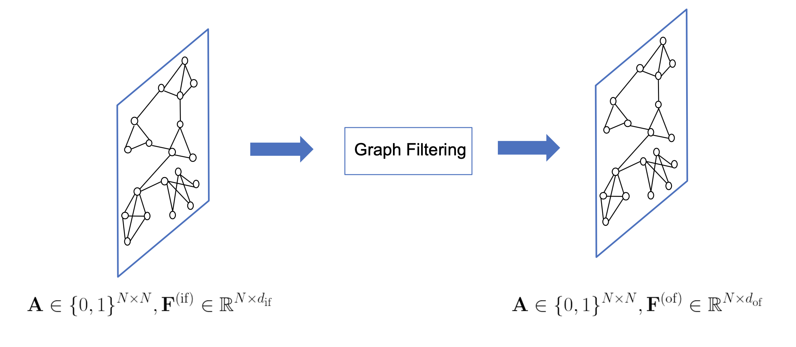
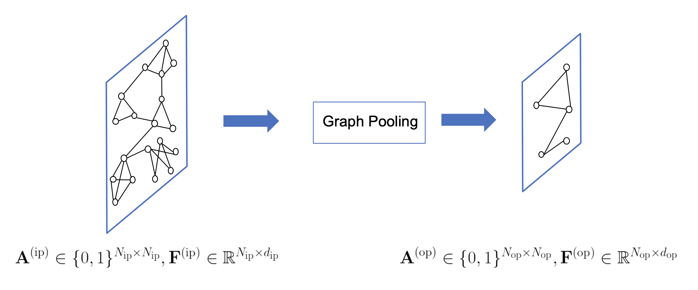

[メインページ](../../index.markdown)

[章目次](./chap5.md)
## 5.1. はじめに

グラフニューラルネットワーク（GNN）は，グラフ構造を持つデータに深層ニューラルネットワークを適用することを目的としている．
グラフ構造は規則的な格子ではないため，古典的な深層ニューラルネットワークをグラフ構造データに一般化することは容易ではない．
グラフニューラルネットワークの研究は,
21世紀初頭に最初のGNNモデル(Scarselli et al., 2005,
2008)がノードとグラフの両方に焦点を当てたタスクのために提案されたことにさかのぼることができる．
深層学習技術がコンピュータビジョンや自然言語処理などの多くの分野で大きな人気を博すようになると，研究者はこの研究分野に力を注ぐようになった．

グラフニューラルネットワークは，グラフの表現学習の一過程として捉えることができる．
ノードに焦点を当てたタスクでは，GNNは各ノードに対して優れた特徴を学習し，タスクが容易にできるようにすることを目標にしている．
グラフに特化したタスクでは，グラフ全体を代表する特徴を学習することを目標としており，ノードの特徴の学習は通常，そのための中間的なステップとなる．
ノードの特徴を学習する過程では，入力ノードの特徴とグラフ構造の双方を活用することが多い．
より具体的には，以下のようにまとめることができる：

 

$$ \mathbf{F}^{(\mathrm{of})}=h\left\(\mathbf{A}, \mathbf{F}^{(\mathrm{if})}\right\) $$

 

ここで， $\mathbf{A} \in \mathbb{R}^{N \times N}$ はノード数Nのグラフの隣接行列（グラフの構造に相当）を表し， $\mathbf{F}^{(\text{if})} \in \mathbb{R}^{N \times d_{\mathrm{if}}}$ と $\mathbf{F}^{(\text{of})} \in \mathbb{R}^{N \times d_{\text {of }}}$ はそれぞれ入力、出力の特徴行列を表す.
なお， $d_{if}$ と $d_{of}$ はそれぞれの特徴行列の次元を表す．
本書では一般に，ノードの特徴とグラフ構造を入力とし，新しいノードの特徴の集合を出力する処理を,
「グラフフィルタリング」と呼ぶことにする．
図5.1中の上付き文字（または下付き文字）\"if \"と \"of
\"は，それぞれフィルタリングの入力と出力を表す．
また，演算子 $h(\cdot, \cdot)$ を「グラフフィルター」と呼ぶ．
図5.1は典型的なグラフフィルタリングであり，フィルタリングはグラフ構造を変えず，ノードの特徴を更新するだけである．

<figure>

<figcaption>図5.1 グラフフィルタリング</figcaption>

</figure>

ノードに焦点をあてたタスクでは，グラフフィルタリングで十分であり，通常は複数のグラフフィルタリング操作を連続的に積み重ねることで最終的なノードの特徴量を生成する．
しかし，グラフに焦点をあてたしたタスクでは，ノード特徴量からグラフ全体の特徴量を生成するために他の演算が必要になる．
そこで，古典的なCNNと同様に，ノードの特徴量をまとめてグラフレベルの特徴量を生成する，プーリング演算が提案されている．
古典的なCNNは規則正しいグリッド上に存在するデータに適用される．
しかし，グラフ構造は不規則であるため，グラフニューラルネットワークでは専用のプーリング演算が必要となる．
グラフに対するプーリング演算は，グラフ構造情報を利用するのが自然である．
実際，プーリング演算はグラフを入力とし，ノード数の少ない粗くなったグラフを生成することが多い．
従って，プーリング演算の鍵は，粗くなったグラフのグラフ構造（または隣接行列）とノードの特徴を生成することである．
一般に，図5.2に示すように，グラフプーリング演算は以下のように記述することができる．

 $$ \mathbf{A}^{(\mathrm{op})}, \mathbf{F}^{(\mathrm{op})}=\operatorname{pool}\left\(\mathbf{A}^{(\mathrm{ip})}, \mathbf{F}^{(\mathrm{ip})}\right\)
    
\tag{5.2} $$ 

ここで， $\mathbf{A}^{(\mathrm{ip})} \in \mathbb{R}^{N_{\mathrm{ip}} \times N_{\mathrm{ip}}}$ と $\mathbf{F}^{(\mathrm{ip})} \in \mathbb{R}^{N_{\mathrm{ip}} \times d_{\mathrm{ip}}}$ ,
そして
 $\mathbf{A}^{(\mathrm{op})} \in \mathbb{R}^{N_{\mathrm{op}} \times N_{\mathrm{op}}}$ と
 $\mathbf{F}^{(\mathrm{op})} \in \mathbb{R}^{N_{\mathrm{op}} \times d_{\mathrm{op}}}$ 
はそれぞれ，プーリング前後の隣接行列と特徴量行列を表す．
同様に，上付き文字（または下付き文字）\"ip\" と
\"op\"はそれぞれ，プーリングの入力と出力を表す．
なお、粗視化されたグラフのノード数 $N_{\mathrm{op}}$ に対して， $N_{\mathrm{op}}<N_{\mathrm{ip}}$ 
である．

一般的なグラフニューラルネットワークモデルは，グラフフィルタリングとグラフプーリング操作のどちらか一方，または両方から構成されている．
ノードに焦点を当てたタスクの場合，GNNはグラフフィルタリング演算のみを利用する．
また，グラフフィルタリング層が複数連続し，前の層の出力が次の層の入力となるような構成が一般的である．
グラフに特化したタスクの場合，GNNはグラフフィルタリングとグラフプーリング演算の両方を必要とする．
プーリング層は通常，グラフフィルタリング層をブロックに分割する．
本章では，まずGNNの一般的な構成を簡単に紹介し，次に代表的なグラフフィルタリン
グとグラフプーリング演算の詳細を説明する．

<figure>

<figcaption>図5.2 グラフプーリング</figcaption>

</figure>

[メインページ](../../index.markdown)

[章目次](./chap5.md)

[前の節へ](./subsection_00.md) [次の節へ](./subsection_02.md)

