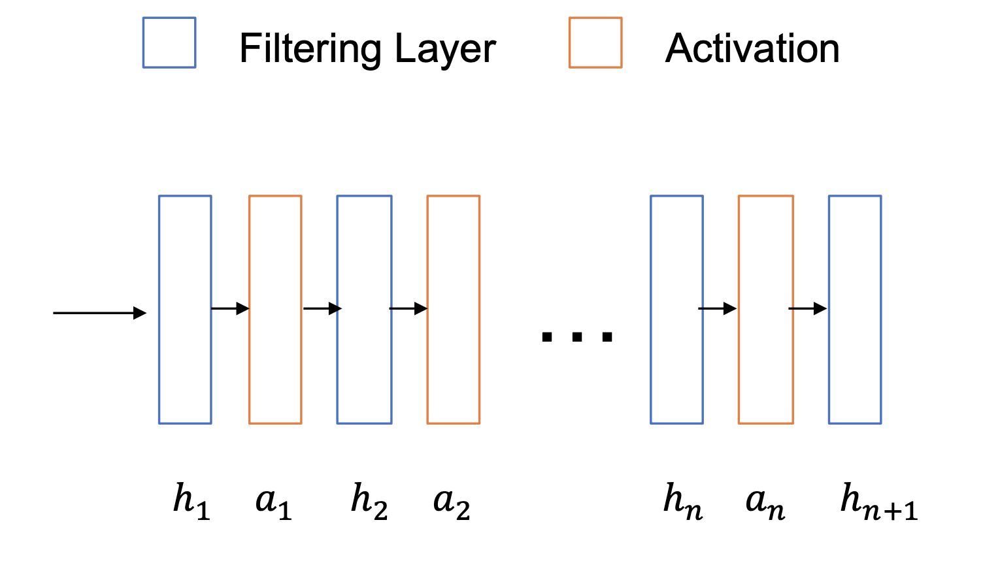
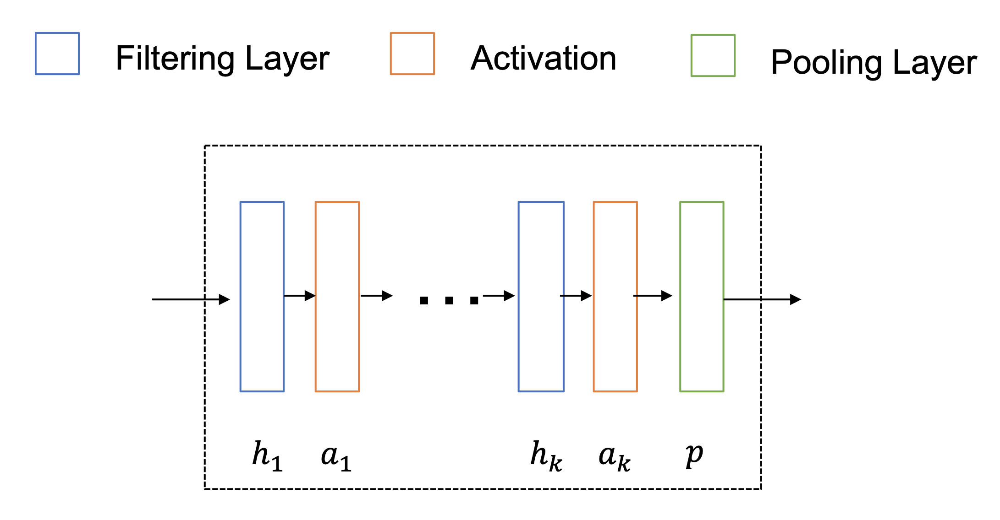
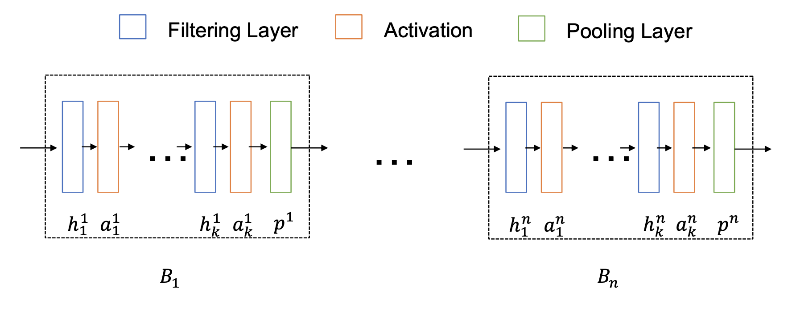

[メインページ](../../index.markdown)

[章目次](./chap5.md)
## 5.2. 一般的なGNNのフレームワーク

本節では，ノードに焦点をあてたタスク，グラフに焦点をあてたタスクそれぞれについて,
一般的なGNNのフレームワークを紹介する．
初めに，本節以降で使う記法を導入する．
グラフは $\mathcal{G}=\{\mathcal{V},\, \mathcal{E}\}$ と書く．
Nノードからなるグラフの隣接行列は $\mathbf{A}$ と書く．
グラフの特徴量は $\mathbf{F} \in \mathbb{R}^{N \times d}$ と書く．
 $\mathbf{F}$ の書く行はノードに対応し, $d$ は特徴量の次元である．

### ノードに焦点をあてたタスクのフレームワーク

ノードに焦点をあてたタスクのフレームワークは，グラフフィルタリングと非線形活性化関数から構成されているとみなすことができる．
図5.3に $L$ 個のグラフフィルタリング層と $L-1$ 個の活性化層(3.2.2節参照)
からなるGNNのフレームワークを示した．
ここで， $h_i()$ と $\alpha_i()$ はそれぞれ $i$ 番目のグラフフィルタリングと活性化層を表す．
 $\mathbf{F}^{(i)}$ を $i$ 番目のグラフフィルタリングの出力とする．
さらに， $d_i$ を $\mathbf{F}^{(i)}$ の次元を表すとする．
グラフ構造は変化しないので， $\mathbf{F}^{(i)} \in \mathbb{R}^{N \times d\_i}$ となる．
 $i$ 番目のグラフフィルタリング層は次のように書くことができる：

 

$$ \mathbf{F}^{(i)}=h\_i\left\(\mathbf{A}, \alpha_{i-1}\left\(\mathbf{F}^{(i-1)}\right\)\right\) \nonumber $$

 

ここで， $\alpha_{i-1}()$ は $(i-1)$ 番目のグラフフィルタリング層に続く，要素ごとの活性化関数である．
なお，入力に対しては活性化関数を適用しないので,
（表記を少しばかり雑に扱ってしまうが） $\alpha_0$ は恒等変換を表す．
最終的な出力 $\mathbf{F}^{(L)}$ は，専用の層へ入力され，後段のノードに焦点を当てたタスクに応じて活用されることになる．

<figure>

<figcaption>図5.3 ノードに焦点をあてたタスクのフレームワーク</figcaption>

</figure>

### グラフに焦点をあてたタスクのフレームワーク

グラフに焦点をあてたタスクのためのGNNのフレームワークは,
グラフフィルタリング層，活性化層，グラフプーリング層の3種類の層から構成されている．
グラフフィルタリング層と活性化層は，ノードに焦点をあてたタスクの場合のフレームワークと同様の機能を持つ．
これらの層はより良いノードの特徴量を生成するために使用される．
グラフプーリング層は，ノードの特徴量を集約し，グラフ全体の情報を把握できるようなより高次の特徴量を生成するために利用される．
一般に，グラフプーリング層は，一連のグラフフィルタリング層と活性化層のあとに続く．
グラフプーリング層の後に，より抽象的で高次のノードの特徴量を持つ，粗視化されたグラフが生成される．
これらの層は図5.4のようなブロックにまとめることができる．
ここで， $h_i, \alpha_i, p$ はそれぞれ，このブロックの  $i$ 
番目のフィルタリング層、 $i$  番目の活性化層，プーリング層を表す．
ブロックの入力はグラフ $\mathcal{G}_{i b}=\left\\{\mathcal{V}_{i b}, \mathcal{E}_{i b}\right\\}$ の隣接行列 $\mathbf{A}^{(ib)}$ と特徴量 $\mathbf{F}^{(ib)}$ であり,
出力は新たに生成された，粗視化されたグラフ $\mathcal{G}_{o b}=\left\\{V_{o b}, \mathcal{E}_{o b}\right\\}$ の隣接行列 $\mathbf{A}^{(ob)}$ と特徴量 $\mathbf{F}^{(ob)}$ である．
ブロックにおける計算手順は次のように定式化することができる．
 

$$
\begin{aligned}
    &&\mathbf{F}^{(i)}=h\_i\left\(\mathbf{A}^{(i b)}, \alpha_{i-1}\left\(\mathbf{F}^{(i-1)}\right\)\right\) \quad \text { for } \quad i=1, \ldots k \nonumber \\
    &&\mathbf{A}^{(o b)}, \mathbf{F}^{(o b)}=p\left\(\mathbf{A}^{(i b)}, \mathbf{F}^{(k)}\right\)
    
\end{aligned}
\tag{5.3}
$$
 
ここで， $\alpha_i$ は $i \neq 0$ において活性化関数, $\alpha_0$ は恒等変換であり， $\mathbf{F}^{(0)}=\mathbf{F}^{i b}$ が成り立つ.
以上の計算をまとめると,
 

$$ \mathbf{A}^{(o b)}, \mathbf{F}^{(o b)}=B\left\(\mathbf{A}^{(i b)}, \mathbf{F}^{(i b)}\right\) $$

 

<figure>

<figcaption>図5.4 グラフに焦点をあてたタスクのためのGNNの構成ブロック</figcaption>

</figure>

図5.5に示したように，GNN全体はさらに一つ以上のブロックから構成される．
 $L$ 個のブロックからなるGNNの計算過程は次のように定式化することができる：

 $$ \mathbf{A}^{(j)}, \mathbf{F}^{(j)}=B^{(j)}\left\(\mathbf{A}^{(j-1)}, \mathbf{F}^{(j-1)}\right\) \quad \text { for } \quad j=1, \ldots, L
    
\tag{5.4} $$ 

ここで,
 $\mathbf{F}^{(0)}=\mathbf{F}$ と $\mathbf{A}^{(0)}=\mathbf{A}$ はそれぞれ，もとのグラフの初めの特徴量と隣接行列を表す．
式(5.4)に示したように，ブロックの出力が続くブロックの入力となっている．
ブロックが一つだけの場合(つまり $L=1$ のとき)は，GNNはもとのグラフから直接グラフレベルでの特徴量を生成することになるため，GNNのフレームワークは「フラットである」とされる．
プーリング層付きのGNNのフレームワークは， $L>1$ のときに階層的であるとみなすことができる．
このとき，グラフの特徴量は，だんだんと粗視化されたグラフを生成しながら，徐々にノードの特徴量に集約されていくことになる．

<figure>

<figcaption>図5.5 グラフに焦点をあてたタスクのGNNの構成</figcaption>

</figure>

[メインページ](../../index.markdown)

[章目次](./chap5.md)

[前の節へ](./subsection_01.md) [次の節へ](./subsection_03.md)

