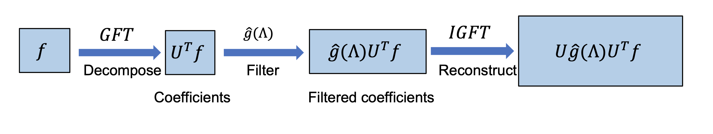

[メインページ](../../index.markdown)

[章目次](./chap5.md)
## 5.3. グラフフィルター

グラフフィルターの設計には様々な視点があり，大きく2つに分類される： 1)
空間型グラフフィルターと2) スペクトル型グラフフィルターである．
空間グラフフィルタは，グラフ構造（ノード間の接続）を明示的に利用して，グラフ領域での特徴量を洗練させる．
これに対して，スペクトル型グラフフィルターは、スペクトル領域でのフィルタリング演算を設計するためにスペクトルグラフ理論を利用する．
これら2つのグラフフィルターは密接に関連している．
特に，スペクトル型グラフフィルターのいくつかは，空間型グラフフィルターとみなすこともできる．
本節では，スペクトル型グラフフィルターを紹介し，スペクトル型グラフフィルターのいくつかがどのように空間的な観点から解釈することができるかを説明する．
その後で，より多くの空間型グラフフィルターについて議論する．

### スペクトル型グラフフィルター

スペクトル型グラフフィルターは，グラフ信号のスペクトル理論を用いる．
まず，グラフのスペクトルフィルタリングについて紹介し，それをどのようにスペクトル型グラフフィルターの設計に応用するかを説明する．

#### グラフのスペクトルフィルタリング

図5.6に示すように，グラフのスペクトルフィルタリングは，グラフ信号の周波数を変調し，ある周波数成分を保持・増幅し，他の周波数成分を除去・減少させる．
そこで，グラフ信号 $\mathbf{f} \in \mathbb{R}^{N}$ に対して，まずグラフフーリエ変換（Graph
Fourier Transform, GFT）を適用し，信号のグラフフーリエ係数を取得する．
次に，その係数を変調し，空間領域でグラフ信号を再構成する．

2章で導入したように，グラフ $\mathcal{G}$ 上の信号 $\mathbf{f} \in \mathbb{R}^{N}$ のGFTは次のように定義される：
 

$$ \hat{\mathbf{f}}=\mathbf{U}^{\top} \mathbf{f} $$

 
ここで， $\mathbf{U}$ は $\mathcal{G}$ のラプラシアン行列の固有ベクトルで構成され， $\hat{\mathbf{f}}$ は信号 $\mathbf{f}$ のグラフフーリエ係数を表す．
このグラフフーリエ係数は，各グラフフーリエ成分がグラフ信号 $\mathbf{f}$ にどのように寄与しているかを表している．
具体的には， $\hat{\mathbf{f}}$ の $i$ 番目の要素は，周波数 $\lambda\_i$ の $i$ 番目のグラフフーリエ成分 $\mathbf{u}_i$ に対応する．
なお， $\lambda\_i$ は $\mathbf{u}_i$ の固有値である．
信号 $\mathbf{f}$ の周波数を変調するために，グラフフーリエ係数を以下のようにフィルタリングする：
 

$$ \hat{\mathbf{f}}^{\prime}[i]=\hat{\mathbf{f}}[i] \cdot \symbfscr{G}amma\left\(\lambda\_i\right\), \text { for } \quad i=1, \ldots, N $$

 
ここで， $\symbfscr{G}amma\left\(\lambda\_i\right\)$ は周波数 $\lambda\_i$ を入力として，対応する周波数成分をどの程度変調させるかを決める関数である．
これを行列形式で書くと次のようになる：
 

$$ \hat{\mathbf{f}}^{\prime}=\symbfscr{G}amma(\boldsymbol{\Lambda}) \cdot \hat{\mathbf{f}}=\symbfscr{G}amma(\boldsymbol{\Lambda}) \cdot \mathbf{U}^{\top} \mathbf{f} $$

 
ここで， $\boldsymbol{\Lambda}$ は周波数（ラプラシアン行列の固有値）から構成される対角行列で,
 $\symbfscr{G}amma(\boldsymbol{\Lambda})$ は $\boldsymbol{\Lambda}$ の対角成分の各要素に $\symbfscr{G}amma()$ が適用されていることを表す．
 $\boldsymbol{\Lambda}$ と $\symbfscr{G}amma(\boldsymbol{\Lambda})$ は次のように書くことができる：
 

$$ \boldsymbol{\Lambda}=\left\(\begin{array}{ccc}\lambda\_1 & & 0 \\ & \ddots & \\ 0 & & \lambda\_N\end{array}\right\) ; \quad \symbfscr{G}amma(\boldsymbol{\Lambda})=\left\(\begin{array}{ccc}\symbfscr{G}amma\left\(\lambda\_1\right\) & & 0 \\ & \ddots & \\ 0 & & \symbfscr{G}amma\left\(\lambda\_N\right\)\end{array}\right\) $$

 

<figure>

<figcaption>図5.6 スペクトルフィルタリングの流れ</figcaption>

</figure>

フィルタリングされたフーリエ係数を用いて,
次のように逆グラフフーリエ変換（IGFT）により信号をグラフ領域に再構成することができる：

 $$ \mathbf{f}^{\prime}=\mathbf{U} \hat{\mathbf{f}}^{\prime}=\mathbf{U} \cdot \symbfscr{G}amma(\boldsymbol{\Lambda}) \cdot \mathbf{U}^{\top} \mathbf{f}
    
\tag{5.5} $$ 

ここで， $\mathbf{f}^{\prime}$ は得られたフィルタリングされたグラフ信号である．
フィルタリング処理は，入力されたグラフ信号に，演算子 $\mathbf{U} \cdot \symbfscr{G}amma(\boldsymbol{\Lambda}) \cdot \mathbf{U}^{\top}$ を適用することと見なすことができる．
便宜上、関数 $\symbfscr{G}amma(\boldsymbol{\Lambda})$ をフィルタと呼ぶこともある．
というのは， $\symbfscr{G}amma(\boldsymbol{\Lambda})$ がグラフ信号 $\mathbf{f}$ の各周波数成分をどのようにフィルタリングするかを制御するからである．
例えば，極端な例では、 $\symbfscr{G}amma\left\(\lambda\_i\right\)$ が0に等しい場合， $\hat{\mathbf{f}}^{\prime}[i]=0$ となり，グラフ信号 $\mathbf{f}$ から周波数成分 $\mathbf{u}_i$ が取り除かれることになる．

 
<strong>例 5.1 Shuman et al., 2013</strong>

グラフ $\mathcal{G}$ 上で定義されたノイズの多いグラフ信号 $\mathbf{y}=\mathbf{f}_0+\eta$ （ $\eta$ は無相関加法性ガウスノイズ）を考える．
元の信号 $\mathbf{f}_0$ を復元するという問題を考える．
元の信号 $\mathbf{f}_0$ は，もとのグラフ $\mathcal{G}$ に対して滑らかであると仮定する．
このクリーンな信号 $\mathbf{f}_0$ の滑らかさの事前情報を取り入れるため，以下のように $\mathbf{f}^{\top} \mathbf{L f}$ の形の正則化項をこの最適化問題に追加する：

 $$ \arg \min _{\mathbf{f}}\\|\mathbf{f}-\mathbf{y}\\|^{2}+c \mathbf{f}^{\top} \mathbf{L} \mathbf{f}
    
\tag{5.6} $$ 

ここで， $c > 0$  は平滑性を制御するための定数である．
目的関数は凸関数であるので，その微分を0にすることで最適解 $\mathbf{f}^{\prime}$ を得ることができる：
 

$$
\begin{aligned}
    && 2(\mathbf{f}-\mathbf{y})+2 c \mathbf{L} \mathbf{f}=0 \nonumber\\ 
    &\Rightarrow &(I+c \mathbf{L}) \mathbf{f}=\mathbf{y} \nonumber\\ 
    &\Rightarrow &\left(\mathbf{U U}^{\top}+c \mathbf{U} \boldsymbol{\Lambda} \mathbf{U}^{\top}\right) \mathbf{f}=\mathbf{y} \nonumber \\ 
    &\Rightarrow & \mathbf{U}(\mathbf{I}+c \boldsymbol{\Lambda}) \mathbf{U}^{\top} \mathbf{f}=\mathbf{y} \nonumber \\ 
    &\Rightarrow & \mathbf{f}^{\prime}=\mathbf{U}(\mathbf{I}+c \boldsymbol{\Lambda})^{-1} \mathbf{U}^{\top} \mathbf{y}
    
\end{aligned}
\tag{5.7}
$$
 

式(5.5)と式(5.7)を比較すると，ノイズの多い信号 $\mathbf{y}$ をフィルター $\symbfscr{G}amma(\boldsymbol{\Lambda})=(\mathbf{I}+c \boldsymbol{\Lambda})^{-1}$ を用いてフィルタリングすることで,
きれいな信号を得られることがわかる．
特定の周波数 $\lambda_l$ に対しては，このフィルターは次のように書くことができる．

 $$ \symbfscr{G}amma\left(\lambda_l\right)=\frac{1}{1+c \lambda_l}
    
\tag{5.8} $$ 

ここで，明らかに $\symbfscr{G}amma\left(\lambda_l\right)$ はローパスフィルターとなっている．
実際， $\lambda_l$ が小さいときに $\symbfscr{G}amma\left(\lambda_l\right)$ が大きくなり,
 $\lambda_l$ が大きいときに $\symbfscr{G}amma\left(\lambda_l\right)$ が小さくなる．
したがって，式(5.6)の最適化問題を解くことは，ノイズの多い信号 $\mathbf{y}$ に対して式(5.8)のローパスフィルターを適用することと同じことになる．

#### スペクトル型グラフフィルター

ここまでで，グラフスペクトルフィルタリング演算子を導入したが,
この演算子は入力信号の特定の周波数をフィルタリングするために使うことができる．
例えば，フィルタリング後の信号を滑らかにしたい場合， $\lambda$ が小さいときに $\symbfscr{G}amma(\lambda)$ 大きく， $\lambda$ が大きいときに $\symbfscr{G}amma(\lambda)$ が小さくなるようなローパスフィルターを設計すればよい．
このように，フィルタリングされた信号は，入力信号の低周波部分を主に含んでいるため，滑らかな信号となる．
ローパスフィルターの一例は例 5.1である．
入力信号の周波数をどのように変調したいかがわかっていれば，それに応じた関数 $\symbfscr{G}amma(\lambda)$ を設計することができる．
しかし，グラフニューラルネットワークにおいて，スペクトル型フィルタをグラフフィルターとして利用する場合，どの周波数が重要であるかはわかっていないことが多い．
そこで，古典的なニューラルネットワークと同様に，グラフフィルターをデータドリブンで学習させることができる．
具体的には， $\symbfscr{G}amma(\lambda)$ をある関数でモデル化し，そのパラメータをデータから学習させることができる．

 $\symbfscr{G}amma()$ を設計する際には, (まずは)何も制約を入れないのが自然である．
 $\symbfscr{G}amma()$ は次のように定義される(Bruna et al., 2013)：

 

$$ \symbfscr{G}amma\left\(\lambda_l\right\)=\theta\_l \nonumber $$

 

ここで， $\theta\_l$ はデータから学習されるパラメータである．
行列形式で書くとつぎのようになる：

 

$$ \symbfscr{G}amma(\Lambda)=\left\(\begin{array}{lll}\theta\_1 & & 0 \\ & \ddots & \\ 0 & & \theta\_N\end{array}\right\) \nonumber $$

 

しかし，このようなフィルタには限界がいくつかある．
まず，学習すべきパラメータの数はノードの数 $N$ に等しく，現実のグラフでは非常に大きくなることがある．
したがって，これらのパラメータを格納するための大量のメモリと，それを適合させるための豊富なデータが必要になる．
次に，フィルター $\mathbf{U} \cdot \symbfscr{G}amma(\Lambda) \cdot \mathbf{U}^{\top}$ は密な行列になることが多い．
したがって，出力信号 $\mathbf{f}_0$ の $i$ 番目の要素の計算は，グラフ内のすべてのノードに関係する可能性がある．
つまり，この演算子は空間的に局在していない．
さらに， $\mathbf{U} \cdot \symbfscr{G}amma(\Lambda) \cdot \mathbf{U}^{\top}$ を計算する際には，ラプラシアン行列の固有値分解と密な行列同士の行列乗算が必要になり，計算コストがかなり高くなる．

これらの問題に対応するため，多項式フィルターが提案された(Defferrard et
al., 2016)．
 $\symbfscr{G}amma()$ は $K$ 次までの多項式で次のようにモデル化することができる：

 $$ \symbfscr{G}amma\left\(\lambda_l\right\)=\sum_{k=0}^{K} \theta\_k \lambda_l^{k}
    
\tag{5.9} $$ 

行列形式では次のように書き換えることができる：

 $$ \symbfscr{G}amma(\Lambda)=\sum_{k=0}^{K} \theta\_k \Lambda^{k}
    
\tag{5.10} $$ 

明らかに，式(5.9)および式(5.10)のパラメータの数は $K + 1$ であり，グラフのノード数に依存しない．
さらに， $\mathbf{U} \cdot \symbfscr{G}amma(\boldsymbol{\Lambda}) \cdot \mathbf{U}^{\top}$ はラプラシアン行列の多項式に単純化できることがわかる．
これは以下の2つの意味を持つ： 1) 固有値分解は必要ない． 2)
多項式でパラメータ化された演算子は空間的に局在している．
つまり，出力 $\mathbf{f}^{\prime}$ の各要素の計算はグラフ全体の少数のノードにしか関与しない．
次に，多項式フィルター演算子がラプラシアン行列の多項式として定式化できることをまず示し，それを空間的な観点から理解する．

 $\mathbf{f}$ に多項式フィルターを作用させることで,
式(5.5)より，次のように出力 $\mathbf{f}^{\prime}$ を得ることができる：
 

$$
\begin{aligned}
    \mathbf{f}^{\prime} &=&\mathbf{U} \cdot \symbfscr{G}amma(\boldsymbol{\Lambda}) \cdot \mathbf{U}^{\top} \mathbf{f} \nonumber\\ 
    &=&\mathbf{U} \cdot \sum_{k=0}^{K} \theta\_k \boldsymbol{\Lambda}^{k} \cdot \mathbf{U}^{\top} \mathbf{f} \nonumber\\ 
    &=&\sum_{k=0}^{K} \theta\_k \mathbf{U} \cdot \boldsymbol{\Lambda}^{k} \cdot \mathbf{U}^{\top} \mathbf{f}
    
\end{aligned}
\tag{5.11}
$$
 

さらに式(5.11)を簡略化するため，次のように $\mathbf{U} \cdot \boldsymbol{\Lambda}^{k} \cdot \mathbf{U}^{\top}=\mathbf{L}^{k}$ とかけることを使う：
 

$$
\begin{aligned}
    \mathbf{U} \cdot \boldsymbol{\Lambda}^{k} \cdot \mathbf{U}^{\top} &=&\mathbf{U} \cdot\left\(\boldsymbol{\Lambda} \mathbf{U}^{\top} \mathbf{U}\right\)^{k} \mathbf{U}^{\top} \nonumber\\ 
    &=&\underbrace{\left\(\mathbf{U} \cdot \boldsymbol{\Lambda} \cdot \mathbf{U}^{\top}\right\) \cdots\left\(\mathbf{U} \cdot \boldsymbol{\Lambda} \cdot \mathbf{U}^{\top}\right\)}\_k \nonumber\\ &=&\mathbf{L}^{k}
    
\end{aligned}
\tag{5.12}
$$
 

式(5.12)を用いて，式(5.11)は次のように書くことができる：
 

$$
\begin{aligned}
    \mathbf{f}^{\prime} &=&\sum_{k=0}^{K} \theta\_k \mathbf{U} \cdot \boldsymbol{\Lambda}^{k} \cdot \mathbf{U}^{\top} \mathbf{f} \nonumber\\ 
    &=&\sum_{k=0}^{K} \theta\_k \mathbf{L}^{k} \mathbf{f} \nonumber
\end{aligned}
$$
 

ラプラシアン行列の多項式はすべて疎である．
一方で， $\mathbf{L}^k$ の $i,j$ 版目の要素( $i \neq j$ )は，次の補題で説明するように，ノード $v_i$ とノード $v_j$ の間の最短経路が $k$ 以下の場合のみ非ゼロとなる．

::: lem
 $\mathcal{G}$ をグラフとし、 $\mathbf{L}$ をラプラシアン行列とする．
 $\operatorname{dis}\left\(v\_i, v\_j\right\)>k$ ならば
ラプラシアン行列の $k$ 乗の $i,j$ 番目の要素 $\mathbf{L}_{i, j}^{k}$ について,
 $\mathbf{L}_{i, j}^{k}=0$ となる．
:::

<strong>証明: </strong>
 帰納法で示す．
 $k=1$ のとき，ラプラシアン行列 $\mathbf{L}$ の定義より,
 $\operatorname{dis}\left(v_i, v_j\right)>1$ ならば $\mathbf{L}_{i, j}=0$ となるのは明らか．
 $k=n$ で成り立つと仮定すると,
 $\operatorname{dis}\left(v_i, v_j\right)>n$ ならば $\mathbf{L}_{i, j}^{n}=0$ である．
次に， $k=n+1$ で $\operatorname{dis}\left(v_i, v_j\right)>n+1$ ならば $\mathbf{L}_{i, j}^{n+1}=0$ であることを示す．
 $\mathbf{L}_{i, j}^{n+1}$ は $\mathbf{L}^{n}$ と $\mathbf{L}$ を用いて次のように書くことができる：

 

$$ \mathbf{L}_{i, j}^{n+1}=\sum_{h=1}^{N} \mathbf{L}_{i, h}^{n} \mathbf{L}_{h, j} \nonumber $$

 

次に， $h=1, \ldots, N$ のとき $\mathbf{L}_{i, h}^{n} \mathbf{L}_{h, j}=0$ であることを示す．
これは，  $\mathbf{L}_{i, j}^{n+1}=0$ であることを表す．

まず， $\mathbf{L}_{h, j}\neq0$ のとき， $\operatorname{dis}\left(v_h, v_j\right) \leq 1$ である．
これはすなわち， $h=j$ またはノード $v_h$ とノード $v_j$ の間にエッジがあるということを意味する．
 $\operatorname{dis}\left(v_i, v_h\right) \leq n$ ならば， $\operatorname{dis}\left(v_h, v_j\right) \leq 1$ より、 $\operatorname{dis}\left(v_i, v_j\right) \leq n+1$ となるが，これは仮定に反する．
したがって， $\operatorname{dis}\left(v_i, v_h\right)>n$ が成り立つ．
以上より， $\mathbf{L}_{i, h}^{n}=0$ となるが，これはすなわち $\mathbf{L}_{i, h}^{n} \mathbf{L}_{h, j}=0$ が成り立つということである．

 $\mathbf{L}_{h, j}=0$ のときにも
 $\mathbf{L}_{i, h}^{n} \mathbf{L}_{h, j}=0$ が成り立つ．
したがって， $\operatorname{dis}\left(v_i, v_j\right)>n+1$ ならば $\mathbf{L}_{i, j}^{n+1}=0$ である．
以上で補題が示された． 

ここで，出力信号 $\mathbf{f}^{\prime}$ の1つの要素に着目し,
その計算がグラフの他のノードとどのように関連しているかをみる．
より具体的には，ノード $v_i$ における出力信号の値は，以下のように計算することができる:

 $$ \mathbf{f}^{\prime}[i]=\sum_{v\_j \in \mathcal{V}}\left\(\sum_{k=0}^{K} \theta\_k \mathbf{L}_{i, j}^{k}\right\) \mathbf{f}[j]
    
\tag{5.13} $$ 

これは全ノードの元の信号の、重み $\sum_{k=0}^{K} \theta\_k \mathbf{L}_{i, j}^{k}$ での線形結合とみなすことができる．
系5.2より， $\operatorname{dis}\left\(v\_i, v\_j\right\)>k$ ならば $\mathbf{L}_{i, j}^{k}=0$ である．
したがって，この計算にはすべてのノードが関与するのではなく,
ノード $v_i$ から $K$ ホップ以内のノードのみが関与することになる．
ノード $v_i$ から $K$ ホップ以内の近傍ノードのみを使って式(5.13)を書き換えると,

 $$ \mathbf{f}^{\prime}[i]=b_{i, i} \mathbf{f}[i]+\sum_{v\_j \in \mathcal{N}^{K}\left\(v\_i\right\)} b_{i, j} \mathbf{f}[j]
    
\tag{5.14} $$ 

となる．
ここで， $\mathcal{N}^{K}\left\(v\_i\right\)$ はノード $v_i$ の $K$ ホップ以内のすべてのノードを表す．
 $b_{i, j}$ は次のように定義される:

 

$$ b_{i, j}=\sum_{k=\operatorname{dis}\left\(v\_i, v\_j\right\)}^{K} \theta\_k \mathbf{L}_{i, j}^{k} \nonumber $$

 

ここで， $\operatorname{dis}\left\(v\_i, v\_j\right\)$ はノード $v_i$ とノード $v_j$ 間の最短経路長を表す．
多項式フィルターは，特定のノードの出力を計算するときに，Kホップ近傍だけを含むので，このフィルターは空間領域に局在していることがよく分かる．
さらに，多項式フィルターは，式(5.14)に示したように,
空間グラフ構造に基づいてフィルタリング処理を記述することができるため,
空間型のグラフフィルターとみなすこともできる．
同様のグラフフィルタ演算は(Atwood and Towsley, 2016)で提案されている．
ラプラシアン行列の冪乗を用いる代わりに,
中心ノードのマルチホップ近傍から集約された情報を隣接行列の冪乗で線形に足し上げる方法である．

多項式フィルターには様々な利点があるが，まだいくつかの限界がある．
多項式の基底（ $1, x, x^2 , ...$ 
）が互いに直交していないという大きな問題がある．
したがって，係数は互いに依存し，学習過程での摂動に対して不安定になる．
つまり，ある係数を更新すると，他の係数が変化する可能性がある．
この問題に対処するため，直交基底の集合を持つチェビシェフ多項式がフィルタのモデル化に利用される（Defferrard
et al.，2016）．
次に，チェビシェフ多項式について簡単に説明し，チェビシェフ多項式に基づく「チェビシェフフィルター」について詳しく説明する．

#### チェビシェフ多項式とチェビシェフフィルター

チェビシェフ多項式 $T\_k(y)$ は以下の漸化式で生成することができる:

 $$ T\_k(y)=2 y T_{k-1}(y)-T_{k-2}(y)
    
\tag{5.15} $$ 

なお， $T\_0(y)=1, T\_1(y)=y$ である．
 $y \in[-1,1]$ について，これらのチェビシェフ多項式は，次のような三角関数式で表すことができる:

 

$$ T\_k(y)=\cos (k \arccos (y))\nonumber $$

 

これは，各 $T\_k(y)$ が $[-1,1]$ に限られていることを意味する．
さらに，チェビシェフ多項式は次の関係を満たす:  

$$
\begin{aligned}
    \int_{-1}^{1} \frac{T\_l(y) T\_m(y)}{\sqrt{1-y^{2}}} d y=\left\\{\begin{array}{ll}\delta_{l, m} \pi / 2 & \text { if } m, l>0 \\ \pi & \text { if } m=l=0\end{array}\right\.
    
\end{aligned}
\tag{5.16}
$$
 
ここで, $l=m$ のときのみ， $\delta_{l, m}=1$ が成り立ち，それ以外の場合には $\delta_{l, m}=0$ となる．
式(5.16)はチェビシェフ多項式が互いに直交していることを意味する．
したがって，チェビシェフ多項式は,
 $d y / \sqrt{1-y^{2}}$ を計量としたときの、自乗可積分関数のヒルベルト空間の直交基底を構成する．
これは $L^{2}\left\([-1,1], d y / \sqrt{1-y^{2}}\right\)$ と表される．

チェビシェフ多項式の定義域は $[-1,1]$ で考えているので,
チェビシェフ多項式でフィルターを近似するために,
次のようにラプラシアン行列の固有値をスケール変換し、シフトさせる:

 

$$ \tilde{\lambda}\_l=\frac{2 \cdot \lambda_l}{\lambda\_{\max }}-1 \nonumber $$

 

ここで， $\lambda\_{\max }=\lambda\_N$ はラプラシアン行列の最大の固有値を表す．
この操作により，すべての固有値が $[-1,1]$ の範囲に変換されることは明らかである．
これに対応して，行列形式では，変換後の対角固有値行列は次のように示される:

 

$$ \tilde{\boldsymbol{\Lambda}}=\frac{2 \boldsymbol{\Lambda}}{\lambda\_{\max }}-\mathbf{I} \nonumber $$

 

ここで， $\mathbf{I}$ は単位行列である．
チェビシェフフィルターは，チェビシェフ多項式を途中で打ち切った形でパラメータ化され，次のように定式化される:

 

$$ \symbfscr{G}amma(\boldsymbol{\Lambda})=\sum_{k=0}^{K} \theta\_k T\_k(\tilde{\boldsymbol{\Lambda}}) \nonumber $$

 

グラフ信号 $\mathbf{f}$ にチェビシェフフィルターを作用させる操作は次のように定義される:
 

$$
\begin{aligned}
    \mathbf{f}^{\prime} &=\mathbf{U} \cdot \sum_{k=0}^{K} \theta\_k T\_k(\tilde{\boldsymbol{\Lambda}}) \mathbf{U}^{\top} \mathbf{f} \nonumber\\ 
    &=\sum_{k=0}^{K} \theta\_k \mathbf{U} T\_k(\tilde{\boldsymbol{\Lambda}}) \mathbf{U}^{\top} \mathbf{f}
    
\end{aligned}
\tag{5.17}
$$
 

次に， $\tilde{\mathbf{L}}=\frac{2 \mathbf{L}}{\lambda\_{\max }}-\mathbf{I}$ について， $\mathbf{U} T\_k(\tilde{\boldsymbol{\Lambda}}) \mathbf{U}^{\top}=T\_k(\tilde{\mathbf{L}})$ であることを次の定理より示す．

 
<strong>定理 5.2 </strong>

 $\mathcal{G}$ をグラフとし、 $\mathbf{L}$ をラプラシアン行列とする．
 $k \geq 0$ について，以下が成り立つ．

 

$$ \mathbf{U} T_k(\tilde{\boldsymbol{\Lambda}}) \mathbf{U}^{\top}=T_k(\tilde{\mathbf{L}}) \nonumber $$

 

ここで,

 

$$ \tilde{\mathbf{L}}=\frac{2 \mathbf{L}}{\lambda_{\max }}-\mathbf{I} \nonumber $$

 

<strong>証明: </strong>

 $k=0$ については $\mathbf{U} T_0(\tilde{\boldsymbol{\Lambda}}) \mathbf{U}^{\top}=\mathbf{I}=T_0(\tilde{\mathbf{L}})$ より成り立つ．

 $k=1$ については,  

$$
\begin{aligned}
    \mathbf{U} T_1(\tilde{\boldsymbol{\Lambda}}) \mathbf{U}^{\top} &=&\mathbf{U} \tilde{\boldsymbol{\Lambda}} \mathbf{U}^{\top} \nonumber \\ 
    &=&\mathbf{U}\left(\frac{2 \boldsymbol{\Lambda}}{\boldsymbol{\Lambda}_{\max }}-\mathbf{I}\right) \mathbf{U}^{\top} \nonumber \\ 
    &=&\frac{2 \mathbf{L}}{\lambda_{\max }}-\mathbf{I} \nonumber \\ 
    &=&T_1(\tilde{\mathbf{L}}) \nonumber
\end{aligned}
$$
 
したがって， $k=1$ についても成り立つ．

この式が $k=n-2$ と $k=n-1$ で成り立つとする（ただし $n\geq2$ ）．
 $k=n$ でも成り立つことが式(5.15)より帰納的に示すことができる:
 

$$
\begin{aligned}
    \mathbf{U} T_n(\tilde{\boldsymbol{\Lambda}}) \mathbf{U}^{\top} &=&\mathbf{U}\left[2 \tilde{\boldsymbol{\Lambda}} T_{n-1}(\tilde{\boldsymbol{\Lambda}})-T_{n-2}(\tilde{\boldsymbol{\Lambda}})\right] \mathbf{U}^{\top} \nonumber\\ 
    &=&2 \mathbf{U} \tilde{\boldsymbol{\Lambda}} T_{n-1}(\tilde{\boldsymbol{\Lambda}}) \mathbf{U}^{\top}-\mathbf{U} T_{n-2}(\tilde{\boldsymbol{\Lambda}}) \mathbf{U}^{\top} \nonumber\\ 
    &=&2 \mathbf{U} \tilde{\boldsymbol{\Lambda}} \mathbf{U} \mathbf{U}^{\top} T_{n-1}(\tilde{\boldsymbol{\Lambda}}) \mathbf{U}^{\top}-T_{n-2}(\tilde{\mathbf{L}}) \nonumber\\ 
    &=&2 \tilde{\mathbf{L}} T_{n-1}(\tilde{\mathbf{L}})-T_{n-2}(\tilde{\mathbf{L}}) \nonumber\\
    &=&T_n(\tilde{\mathbf{L}}) \nonumber
\end{aligned}
$$
  証明終了．

定理5.3より，式(5.17)はさらに以下のように簡単に書くことができる：
 

$$
\begin{aligned}
    \mathbf{f}^{\prime} &=&\sum_{k=0}^{K} \theta\_k \mathbf{U} T\_k(\tilde{\boldsymbol{\Lambda}}) \mathbf{U}^{\top} \mathbf{f} \nonumber\\ 
    &=&\sum_{k=0}^{K} \theta\_k T\_k(\tilde{\mathbf{L}}) \mathbf{f} \nonumber
\end{aligned}
$$
 
したがって，チェビシェフフィルターは多項式フィルターの長所を活かしつつ，摂動に対してより安定している．

#### GCNフィルター

チェビシェフフィルターは，ノードの特徴量を計算する際に，ノードのKホップ近傍の情報を使う．
(Kipf and Welling,
2016a)では，GCNフィルターと名付けられた，チェビシェフフィルターの簡易版が提案されている．
チェビシェフ多項式の次数を $K=1$ とし， $\lambda\_{\max } \approx 2$ と近似することでチェビシェフフィルターを簡略化している：
 

$$
\begin{aligned}
    \symbfscr{G}amma(\boldsymbol{\Lambda}) &=&\theta\_0 T\_0(\tilde{\boldsymbol{\Lambda}})+\theta\_1 T\_1(\tilde{\boldsymbol{\Lambda}}) \nonumber\\ 
    &=&\theta\_0 \mathbf{I}+\theta\_1 \tilde{\boldsymbol{\Lambda}} \nonumber\\ 
    &=&\theta\_0 \mathbf{I}+\theta\_1(\boldsymbol{\Lambda}-\mathbf{I}) \nonumber
\end{aligned}
$$
 
これに対応して，グラフ信号 $\mathbf{f}$ にGCNフィルターを適用することで，出力信号 $\mathbf{f}^{\prime}$ を次のように得ることができる：
 

$$
\begin{aligned}
    \mathbf{f}^{\prime} &=&\mathbf{U} \symbfscr{G}amma(\boldsymbol{\Lambda}) \mathbf{U}^{\top} \mathbf{f} \nonumber\\ 
    &=&\theta\_0 \mathbf{U I} \mathbf{U}^{\top} \mathbf{f}+\theta\_1 \mathbf{U}(\boldsymbol{\Lambda}-\mathbf{I}) \mathbf{U}^{\top} \mathbf{f} \nonumber\\ 
    &=&\theta\_0 \mathbf{f}-\theta\_1(\mathbf{L}-\mathbf{I}) \mathbf{f} \nonumber\\ 
    &=&\theta\_0 \mathbf{f}-\theta\_1\left\(\mathbf{D}^{-\frac{1}{2}} \mathbf{A} \mathbf{D}^{\frac{1}{2}}\right\) \mathbf{f}
    
\end{aligned}
\tag{5.18}
$$
 
なお，式(5.18)は，定義2.29で定義した正規化したラプラシアン( $\mathbf{L}=\mathbf{I}-\mathbf{D}^{-\frac{1}{2}} \mathbf{A} \mathbf{D}^{-\frac{1}{2}}$ )を用いることで成り立つ．
 $\theta=\theta\_0=-\theta\_1$ とすることで式(5.18)はさらに簡略化することができ,
 

$$
\begin{aligned}
    \mathbf{f}^{\prime} &=&\theta\_0 \mathbf{f}-\theta\_1\left\(\mathbf{D}^{-\frac{1}{2}} \mathbf{A} \mathbf{D}^{\frac{1}{2}}\right\) \mathbf{f} \nonumber\\ 
    &=&\theta\left\(\mathbf{I}+\mathbf{D}^{-\frac{1}{2}} \mathbf{A} \mathbf{D}^{-\frac{1}{2}}\right\) \mathbf{f}
    
\end{aligned}
\tag{5.19}
$$
 
ここで，行列 $\mathbf{I}+\mathbf{D}^{-\frac{1}{2}} \mathbf{A} \mathbf{D}^{-\frac{1}{2}}$ の固有値の範囲は $[0,2]$ である．
信号 $\mathbf{f}$ に対してこの操作が繰り返し行われた場合には，この固有値の範囲のために数値的に不安定になる可能性がある．
したがって，この問題に対処するため，次のように変換する．
 $\tilde{\mathbf{D}}^{-\frac{1}{2}} \tilde{\mathbf{A}} \tilde{\mathbf{D}}^{-\frac{1}{2}}$ を使って，式(5.19)の $\mathbf{I}+\mathbf{D}^{-\frac{1}{2}} \mathbf{A} \mathbf{D}^{-\frac{1}{2}}$ を置き換える．
ここｔで， $\tilde{\mathbf{A}}=\mathbf{A}+\mathbf{I}$ かつ $\tilde{\mathbf{D}}_{i i}=\sum\_j \tilde{\mathbf{A}}_{i, j}$ である．
最終的に，GCNフィルターは次のように定義される：

 $$ \mathbf{f}^{\prime}=\theta \tilde{\mathbf{D}}^{-\frac{1}{2}} \tilde{\mathbf{A}} \tilde{\mathbf{D}}^{-\frac{1}{2}} \mathbf{f}
    
\tag{5.20} $$ 

 $\tilde{\mathbf{D}}^{-\frac{1}{2}} \tilde{\mathbf{A}} \tilde{\mathbf{D}}^{-\frac{1}{2}}$ の $i,j$ 番目の要素は，ノード $v_i, v_j$ がつながっているときのみ非ゼロになる．
1つのノードに注目すると，この処理はそのノード自身を1ホップ近傍とみなしたうえで，そのノードの1ホップ近傍の情報を集約していると解釈することができる．
したがって，GCNフィルターは，ノードの特徴を更新する際に，直接つながった近傍ノードのみを含む，空間ベースのフィルターと見なすことができる．

#### 複数チャネルのグラフ信号に対するグラフフィルター

ここまでで, 1チャンネルのグラフ信号に対するグラフフィルターを導入した．
そこでは各ノードには1つのスカラー値が割り当てられていた．
しかし実際には，グラフ信号は多チャンネルを持つことが多い．
つまり，各ノードがベクトル値を持つ．
次元 $d_{\text {in }}$ の多チャンネルのグラフ信号は $\mathbf{F} \in \mathbb{R}^{N \times d_{i n}}$ と書くことができる．
グラフフィルターを多チャンネル信号に拡張するため，以下のようにすべての入力チャンネルからの信号を利用して出力信号を生成する：

 

$$ \mathbf{f}_{o u t}=\sum_{d=1}^{d_{i n}} \mathbf{U} \cdot \symbfscr{G}amma\_d(\boldsymbol{\Lambda}) \cdot \mathbf{U}^{\top} \mathbf{F}_{:, d}\nonumber $$

 

ここで， $\mathbf{f}_{\text {out }} \in \mathbb{R}^{N}$ は1チャンネルの出力信号で， $\mathbf{F}_{:, d} \in \mathbb{R}^{N}$ は入力信号の $d$ 番目のチャンネルである．
したがって，この操作は，各入力信号にグラフフィルターを適用し，それらを合計したものとみなすことができる．
古典的な畳み込みニューラルネットワークと同様に，多くの場合，多チャンネルのフィルターを入力チャンネルに適用し，出力も多チャンネルになる．
 $d_{\text {out }}$ フィルターを使うとすると， $d_{\text {out }}$ チャンネルの出力信号を生成する操作は次のように定義される：

 

$$ \mathbf{F}_{:, j}^{\prime}=\sum_{d=1}^{d_{i n}} \mathbf{U} \cdot \symbfscr{G}amma_{j, d}(\boldsymbol{\Lambda}) \cdot \mathbf{U}^{\top} \mathbf{F}_{:, d} \quad \text { for } j=1, \ldots, d_{o u t} \nonumber $$

 

特に，式(5.20)のGCNフィルターの場合，この多チャンネルの操作は次のように簡単に表現することができる：

 

$$ \mathbf{F}_{:, j}^{\prime}=\sum_{d=1}^{d_{i n}} \theta_{j, d} \tilde{\mathbf{D}}^{-\frac{1}{2}} \tilde{\mathbf{A}} \tilde{\mathbf{D}}^{-\frac{1}{2}} \mathbf{F}_{:, d} \quad \text { for } j=1, \ldots, d_{o u t} \nonumber $$

 

さらに行列形式で書くと,

 $$ \mathbf{F}^{\prime}=\tilde{\mathbf{D}}^{-\frac{1}{2}} \tilde{\mathbf{A}} \tilde{\mathbf{D}}^{-\frac{1}{2}} \mathbf{F} \Theta
    
\tag{5.21} $$ 

ここで, $\boldsymbol{\Theta} \in \mathbb{R}^{d_{\text {in }} \times d_{\text {out }}}$ であり,
 $\boldsymbol{\Theta}_{d, j}=\theta_{j, d}$ は $j$ 番目の出力チャンネルと $d$ 番目の入力チャンネルに対応するパラメータである．
特に,
1つのノード $v_i$ に対して，式(5.21)のフィルター操作は次のように書くこともできる：

 $$ \mathbf{F}\_i^{\prime}=\sum_{\left\.v\_j \in \mathcal{N}\left\(v\_i\right\) \cup v\_i\right\\}}\left\(\tilde{\mathbf{D}}^{-\frac{1}{2}} \tilde{\mathbf{A}} \tilde{\mathbf{D}}^{-\frac{1}{2}}\right\)_{i, j} \mathbf{F}\_j \boldsymbol{\Theta}=\sum_{v\_j \in \mathcal{N}\left\(v\_i\right\) \cup\left\\{v\_i\right\\}} \frac{1}{\sqrt{\tilde{d}\_i \tilde{d}\_j}} \mathbf{F}\_j \boldsymbol{\Theta}
    
\tag{5.22} $$ 

ここで， $\tilde{d}\_i=\tilde{\mathbf{D}}_{i, i}$ であり， $\mathbf{F}\_i \in \mathbb{R}^{1 \times d_{o u t}}$ は $\mathbf{F}$ の $i$ 行目（例えばノード $v_i$ の特徴量など）を表す．
式(5.22)の操作はノード $v_i$ の1ホップ近傍の情報を集約しているとみなすことができる．

### 空間型グラフフィルター

式(5.22)で示したように，ノード $v_i$ について，GCNフィルターは1ホップ近傍の空間情報を集約する．
そのフィルターのパラメータからなる行列 $\boldsymbol{\theta}$ は，入力ノードの特徴量に対する線形変換とみなすことができる．
実際，GNNにおける空間型フィルターは深層学習が普及する以前から提案されている(Scarselli
et al.)． 最近では，GNNのために様々な空間型フィルターが設計されている．
本節では，一番最初の空間型フィルター(Scarselli et al., 2005,
2008)とより発展的な空間型フィルターについて解説する．

#### 一番最初のグラフニューラルネットワークのフィルター

GNNのコンセプトは(Scarselli et al., 2008)で初めて提案された．
このGNNモデルでは，あるノードの特徴をその隣接ノードの特徴を利用して繰り返し更新するものだった．
次に，この最初のGNNモデルにおけるフィルターについて簡単に紹介する．
ここでは具体的に，各ノードが入力ラベルと関連づけられているようなグラフデータを扱うためのモデルが提案されている．
ノード $v_i$ について，対応するラベルが $l_i$ と表すことができる．
フィルター操作においては，入力の特徴量は $\mathbf{F}$ と表される．
ここで $\mathbf{F}_i$ は $\mathbf{F}$ の $i$ 行目であり，ノード $v_i$ の特徴量に対応する．
フィルターの出力は $\mathbf{F}\prime$ で表される．
ノード $v_i$ に対するフィルター操作は次のように書くことができる：

 

$$ \mathbf{F}\_i^{\prime}=\sum_{v\_j \in \mathcal{N}\left\(v\_i\right\)} g\left\(l\_i, \mathbf{F}\_j, l\_j\right\)\nonumber $$

 

ここで， $g()$ は「局所遷移関数」と呼ばれる、パラメータ付きの関数であり，空間的に局在している．
 $v_i$ に対するフィルター操作は1ホップ近郷のみが関係する．
 $g()$ は順伝搬型ニューラルネットワークでモデル化されることが多い．
この関数は，フィルター操作においてグラフのすべてのノードで共通である．
ただし，ノードラベルの情報である $l_i$ は初期の入力情報で，フィルタリング操作では固定される．

#### GraphSAGEフィルター

GraphSAGEモデルは(Hamilton et al., 2017a)で提案された空間型フィルターで,
このフィルターも近傍情報の集約に基づいている．
ある一つのノード $v_i$ について，新しい特徴を生成する操作は次のように定式化することができる：
 

$$
\begin{aligned}
    \mathcal{N}\_S\left\(v\_i\right\) &=&\operatorname{SAMPLE}\left\(\mathcal{N}\left\(v\_i\right\), S\right\) \\ 
\tag{5.23}
    \mathbf{f}_{\mathcal{N}\_S\left\(v\_i\right\)}^{\prime} &=&\operatorname{AGGREGATE}\left\(\left\\{\mathbf{F}\_j, \forall v\_j \in \mathcal{N}\_S\left\(v\_i\right\)\right\\}\right\) \\ 
\tag{5.24}
    \mathbf{F}\_i^{\prime} &=&\sigma\left\(\left\[\mathbf{F}\_i, \mathbf{f}_{N\_S\left\(v\_i\right\)}^{\prime}\right\] \Theta\right\) 
\end{aligned}
\tag{5.25}
$$
 
ここで， $\operatorname{SAMPLE}()$ は集合を入力とし，S個の要素をランダムに抽出して出力する関数
 $\operatorname{AGGREGATE}()$ は近傍ノードの情報を集約する関数であり,
 $\mathbf{f}_{\mathcal{N}\_S\left\(v\_i\right\)}^{\prime}$ は $\operatorname{AGGREGATE}()$ 関数の出力を表す．
 $[\cdot, \cdot]$ は連結操作を表す．
したがって，ある一つのノード $v_i$ に対して，GraphSAGEモデルのフィルターは,
まず近傍ノード $\mathcal{N}\left\(v\_i\right\)$ から $S$ 個のノードをランダムに抽出する(式(5.23))．
次に， $\operatorname{AGGREGATE}()$ 関数で抽出されたノードの情報を集約し，特徴量 $\mathbf{f}_{\mathcal{N}\_S\left\(v\_i\right\)}^{\prime}$ を生成する（式(5.24)）．
最後に，生成した近傍ノードの情報をとノード $v_i$ の過去の特徴量を組み合わせて，ノード $v_i$ の新しい特徴量を生成する（式(5.25)）．
(Hamilton et al.,
2017a)では，下記に示すような様々な $\operatorname{AGGREGATE}()$ 関数が紹介されている．

-   **平均関数.**
    単純にベクトル（ $\left\\{\mathbf{F}\_j, \forall v\_j \in \mathcal{N}\_S\left\(v\_i\right\)\right\\}$ ）の要素ごとの平均をとる方法である．
    ここでの平均関数はGCNにおけるフィルターとよく似ている．
    ノード $v_i$ に対しては，いずれも近傍ノードを加重平均して新しいノード表現とする．
    違いは，ノード $v_i$ の入力表現 $\mathbf{F}_j$ がどのように計算に関わってくるかである．
    GraphSAGEでは， $\mathbf{F}_i$ は近傍ノードの集約情報 $\mathbf{f}_{\mathcal{N}\_S\left\(v\_i\right\)}^{\prime}$ に連結される．
    一方，GCNフィルターでは，ノード $v_i$ はその近傍ノードと等価に扱われ， $\mathbf{F}_i$ は加重平均の一部にすぎない．

-   **LSTM関数.**
    ノード $v_i$ から抽出した近傍ノード集合 $\mathcal{N}\_S\left\(v\_i\right\)$ を系列データとして扱い，LSTM構造を適用する方法である．
    LSTMの最後のユニットの出力が $\mathbf{f}_{\mathcal{N}\_S\left\(v\_i\right\)}^{\prime}$ となる．
    しかし，近傍ノードの自然な順番は存在しないため, (Hamilton et al.,
    2017a)ではランダムな順番が採用されている．

-   **プーリング関数.**
    近傍ノードの情報をまとめるのに最大プーリング処理を行う方法である．
    集約前に，各ノードの入力特徴量はまずニューラルネットワーク層で変換される．
    この操作は次のように記述される：

     

$$ \mathbf{f}_{N\_S\left\(v\_i\right\)}^{\prime}=\max \left\(\left\\{\alpha\left\(\mathbf{F}\_j \boldsymbol{\Theta}_{\mathrm{pool}}\right\), \forall v\_j \in \mathcal{N}\_S\left\(v\_i\right\)\right\\}\right\) \nonumber $$

 

    ここで，max()は要素ごとに適用され， $\boldsymbol{\Theta}_{\mathrm{pool}}$ は変換行列， $\alpha()$ は非線形活性化関数である．

GraphSAGEフィルターは，どの集約関数を用いても1ホップ近傍のみが計算に関わってくるので，空間的に局在している．
また，集約関数は全ノードで共通である．

#### GATフィルター

グラフアテンションネットワーク(GAT)(Veličković́ et al.,2017)
において空間型グラフフィルターを導入するため，自己アテンション機構(Vaswani
et al., 2017) が導入されている．
便宜上，GATにおけるグラフフィルターをGATフィルターと呼ぶことにする．
GATフィルターはGCNフィルターと似ている．
というのも，各ノードの新しい特徴を生成する際に,　近傍ノードからの情報の集約も行うからである．
GCNフィルターではグラフ構造のみに基づいて集約を行うが,
GATフィルターでは近傍ノードの重要度を区別して集約する．
具体的には，あるノード $v_i$ の新しい特徴を生成する際，すべての近傍ノードに注目し，各ノードについて重要度スコアを計算する．
そして，この重要度スコアは，集計の際に線形結合の係数として使われる．
GATフィルターの詳細について次で説明する．

ノード $v\_j \in \mathcal{N}\left\(v\_i\right\) \cup\left\\{v\_i\right\\}$ のノード $v_i$ に対する重要度スコアは次のように計算される:

 $$ e_{i j}=a\left\(\mathbf{F}\_i \boldsymbol{\Theta}, \mathbf{F}\_j \boldsymbol{\Theta}\right\)
    
\tag{5.26} $$ 

ここで， $\boldsymbol{\Theta}$ は共通のパラメータ行列である．
 $a()$ は共通のアテンション関数であり, (Veličković́ et
al.,2017)では1層の順伝搬ネットワークである:

 

$$ a\left\(\mathbf{F}\_i \boldsymbol{\Theta}, \mathbf{F}\_j \boldsymbol{\Theta}\right\)=\operatorname{LeakyReLU}\left\(\mathbf{a}^{\top}\left\[\mathbf{F}\_i \boldsymbol{\Theta}, \mathbf{F}\_j \boldsymbol{\Theta}\right\]\right\) \nonumber $$

 

ここで， $[\cdot,\cdot]$ は連結操作を表し， $\mathbf{a}$ はパラメータ付きのベクトル， $\operatorname{LeakyReLU}$ は3.2.2節で導入した非線形の活性化関数である．
式(5.26)で計算されるスコアは，出力をまともなスケールに保つために集計プロセスの前に規格化される．
 $v_i$ のすべての近傍にわたる規格化は，以下のようにソフトマックス層を通して行われる：

 

$$ \alpha_{i j}=\frac{\exp \left\(e_{i j}\right\)}{\sum_{v\_k \in \mathcal{N}\left\(v\_i\right\) \cup\left\\{v\_i\right\\}} \exp \left\(e_{i k}\right\)} \nonumber $$

 

ここで， $\alpha_{i j}$ は規格化された重要度スコアであり，ノード $v_i$ に対するノード $v_j$ の重要性を表す．
この規格化された重要度スコアにより，ノード $v_i$ の新しい表現 $\mathbf{F}\_i^{\prime}$ は次のように計算される：

 $$ \mathbf{F}\_i^{\prime}=\sum_{v\_j \in \mathcal{N}\left\(v\_i\right\) \cup\left\\{v\_i\right\\}} \alpha_{i j} \mathbf{F}\_j \boldsymbol{\Theta}
    
\tag{5.27} $$ 

ここで， $\boldsymbol{\Theta}$ は式(5.26)と同じ変換行列である．
自己注意機構の学習過程を安定させるため，マルチヘッドの注意機構(Vaswani
et al., 2017)を採用する．
具体的には，式(5.27)の形のM個の独立な注意機構（異なる $\boldsymbol{\Theta}^m$ と $\alpha_{i j}^m$ をもつ）が並列に実行される．
それらの出力は連結され，ノード $v_i$ の最終的な表現が生成される:

 $$ \mathbf{F}\_i^{\prime}=\\|_{m=1}^{M} \sum_{v\_j \in \mathcal{N}\left\(v\_i\right\) \cup\left\\{v\_i\right\\}} \alpha_{i j}^{m} \mathbf{F}\_j \Theta^{m}
    
\tag{5.28} $$ 

ここで，連結操作に対して $\\|$ を使う．
GATフィルターは空間的に局在しており，各ノードについて1ホップ近傍のみがフィルタリング操作に用いられて，新しい表現が作られる．
もとの(Veličković́ et
al.,2017)のモデルでは，各注意機構の出力に対して連結前に活性化関数が適用されている．
式(5.28)の定式化では，便宜上活性化関数を含めなかった．

#### ECCフィルター

グラフのエッジに情報がある場合，グラフフィルターの設計に活用することができる．
具体的には, (Simonovsky and Komodakis,
2017)において，エッジが様々な種類を持つ場合（種類の
数は有限）に対して、エッジ条件付きグラフフィルター（ECCフィルター）が考案されている．
 $v_i$ と $v_j$ 間のエッジに対して，エッジの種類を $t p\left\(v\_i, v\_j\right\)$ と表す．
ECCフィルターは次のように定義される：

 

$$ \mathbf{F}\_i^{\prime}=\frac{1}{\left\\|\mathcal{N}\left\(v\_i\right\)\right\\|} \sum_{v\_j \in \mathcal{N}\left\(v\_i\right\)} \mathbf{F}\_j \boldsymbol{\Theta}_{t p\left\(v\_i, v\_j\right\)} \nonumber $$

 

ここで， $\boldsymbol{\Theta}_{t p\left\(v\_i, v\_j\right\)}$ は種類が $t p\left\(v\_i, v\_j\right\)$ のエッジに共通のパラメータ行列である．

#### GGNNフィルター

(Li et al., 2015) で提案されたGGNNフィルターは, (Scarselli et al., 2008)
で提案された元々のGNNフィルターにGRU（Gated recurrent unit,
GRUの詳細は3.4節参照）を適用したものである．
GGNNフィルターは，有向エッジを持ち、かつ異なる種類のエッジを持つグラフに対して考案されたフィルターである．
具体的には,エッジ $\left\(v\_i, v\_j\right\) \in \mathcal{E}$ について，エッジの種類を $t p\left\(v\_i, v\_j\right\)$ と表す．
エッジには向きがあるので，エッジ $\left\(v\_i, v\_j\right\)$ と $\left\(v\_j, v\_i\right\)$ は異なる種類のエッジになりうる．
つまり， $t p\left\(v\_i, v\_j\right\) \neq t p\left\(v\_j, v\_i\right\)$ である．
ノード $v_i$ に対するGGNNフィルターのフィルター操作は次のように定式化することができる．
 

$$
\begin{aligned}
    \mathbf{m}\_i &=&\sum_{\left\(v\_j, v\_i\right\) \in \mathcal{E}} \mathbf{F}\_j \boldsymbol{\Theta}_{t p\left\(v\_j, v\_i\right\)}^{e} \\ 
\tag{5.29}
    \mathbf{z}\_i &=&\sigma\left\(\mathbf{m}\_i \boldsymbol{\Theta}^{z}+\mathbf{F}\_i \mathbf{U}^{z}\right\) \\ 
\tag{5.30}
    \mathbf{r}\_i &=&\sigma\left\(\mathbf{m}\_i \boldsymbol{\Theta}^{r}+\mathbf{F}\_i \mathbf{U}^{r}\right\) \\
    \widetilde{\mathbf{F}}\_i &=&\tanh \left\(\mathbf{m}\_i \boldsymbol{\Theta}+\left\(\mathbf{r}\_i \odot \mathbf{F}\_i\right\) \mathbf{U}\right\) \\ 
    \mathbf{F}\_i^{\prime} &=&\left\(1-\mathbf{z}\_i\right\) \odot \mathbf{F}\_i+\mathbf{z}\_i \odot \widetilde{\mathbf{F}}\_i 
\end{aligned}
\tag{5.33}
$$
 
ここで， $\boldsymbol{\Theta}_{t p\left\(v\_j, v\_i\right\)}^{e}, \boldsymbol{\Theta}^{z}, \boldsymbol{\Theta}^{r}, \boldsymbol{\Theta}$ は学習するパラメータである．
式(5.29)の最初のステップでは，ノート $v_i$ の近傍ノード（ノード $v_i$ に向かうエッジを持つノード，ノード $v_i$ から出るエッジを持つノード両方）の情報を集約する．
この集約の際，変換行列 $\boldsymbol{\Theta}_{t p\left\(v\_j, v\_i\right\)}^{e}$ は， $v_i$ にエッジの種類 $t p\left\(v\_i, v\_j\right\)$ でつながるすべてのノードで共通である．
残りの式（式(5.30)から式(5.33)）はGRUに対応し，集約した情報 $\mathbf{m}\_i$ を用いて隠れ表現を更新する．
 $\mathbf{z}\_i, \mathbf{r}\_i$ は更新ゲートとリセットゲートで,
 $\sigma(\cdot)$ はシグモイド関数， $\odot$ はアダマール操作を表す．
したがって，GNNフィルターは次のように書くこともできる：
 

$$
\begin{aligned}
    \mathbf{m}\_i &=&\sum_{\left\(v\_j, v\_i\right\) \in \mathcal{E}} \mathbf{F}\_j \Theta_{t p\left\(v\_j, v\_i\right\)}^{e} \\ 
    \mathbf{F}\_i^{\prime} &=&\operatorname{GRU}\left\(\mathbf{m}\_i, \mathbf{F}\_i\right\)
\end{aligned}
\tag{5.35}
$$
 
ここで，式(5.35)は式(5.30)から式(5.33)までをまとめた形になっている．

#### Moフィルター

(Monti et al.,
2017)では，グラフや多様体などの非ユークリッドなデータに対して畳み込み演算を行うための一般的なフレームワーク，すなわち混合モデルネットワーク(MoNet)が紹介されている．
ここでは, (Monti et al.,
2017)におけるグラフフィルター操作(Moフィルターと呼ぶ）について説明する．
ノード $v_i$ を例にそのプロセスを説明する．
各近傍ノード $v\_j \in \mathcal{N}\left\(v\_i\right\)$ について，疑似座標を導入し，ノード $v_j$ と $v_i$ 間の関係性を記述する．
具体的には，中心ノード $v_i$ とその近傍ノード $v_j$ について，疑似座標は各ノードの次数を用いて次のように定義される：

 

$$ c\left\(v\_i, v\_j\right\)=\left\(\frac{1}{\sqrt{d\_i}}, \frac{1}{\sqrt{d\_j}}\right\)^{\top} $$

 

ここで， $d_i$ と $d_j$ はそれぞれノード $v_i$ と $v_j$ の次数を表す．
次にこの疑似座標にガウスカーネルを適用することで,
2つのノード間の関係性を計算する：

 

$$ \alpha_{i, j}=\exp \left\(-\frac{1}{2}\left\(c\left\(v\_i, v\_j\right\)-\mu\right\)^{\top} \boldsymbol{\Sigma}^{-1}\left\(c\left\(v\_i, v\_j\right\)-\mu\right\)\right\) $$

 

ここで， $\mu$ と $\Sigma$ は学習するガウスカーネルの平均ベクトルと共分散行列である．
なお，元の疑似座標をそのまま用いるのではなく，順伝搬ネットワークを使ってまず $c\left\(v\_i, v\_j\right\)$ を変換する．
集約プロセスは次のようになる：

 $$ \mathbf{F}\_i^{\prime}=\sum_{v\_j \in \mathcal{N}\left\(v\_i\right\)} \alpha_{i, j} \mathbf{F}\_j
    
\tag{5.38} $$ 

式(5.38)において、ガウスカーネルは1つ使われているが，典型的には $K$ 個の異なるカーネルが使われる：

 

$$ \mathbf{F}\_i^{\prime}=\sum_{k=1}^{K} \sum_{v\_j \in \mathcal{N}\left\(v\_i\right\)} \alpha_{i, j}^{(k)} \mathbf{F}\_j\nonumber $$

 

ここで， $\alpha_{i, j}^{(k)}$ は $k$ 番目のガウスカーネルを表す．

#### MPNN（空間型グラフフィルターの一般的なフレームワーク）

Message Passing Neural Networks
(MPNN)は一般的なGNNのフレームワークである． GCNフィルター,
GraphSAGEフィルター,
GATフィルターを含む多くの空間ベースのグラフフィルターは，その特殊なケースに他ならない(Gilmer
et al., 2017)．
ノード $v_i$ に対してMPNNフィルターはノードの特徴を次のように更新する：
 

$$
\begin{aligned}
    {l}\mathbf{m}\_i=\sum_{v\_j \in \mathcal{N}\left\(v\_i\right\)} M\left\(\mathbf{F}\_i, \mathbf{F}\_j, \mathbf{e}_{\left\(v\_i, v\_j\right\)}\right\) \\ 
\tag{5.39}
    \mathbf{F}\_i^{\prime}=U\left\(\mathbf{F}\_i, \mathbf{m}\_i\right\)
\end{aligned}
$$
 
ここで， $M()$ はメッセージ関数， $U()$ は更新関数， $\mathbf{e}_{\left\(v\_i, v\_j\right\)}$ は（あれば）エッジの特徴を表す．
メッセージ関数 $M()$ は，近傍ノードからノード $v_i$ に伝搬させるメッセージを生成する．
更新関数 $U()$ は，ノードの元々の特徴量と近傍ノードの特徴量の集約情報を組み合わせて、ノードの特徴量を更新する．
式(5.39)の集約操作を別の操作に置き換えることでさらに一般的なフレームワークにすることができる．

[メインページ](../../index.markdown)

[章目次](./chap5.md)

[前の節へ](./subsection_02.md) [次の節へ](./subsection_04.md)

